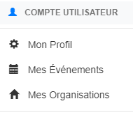
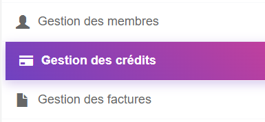
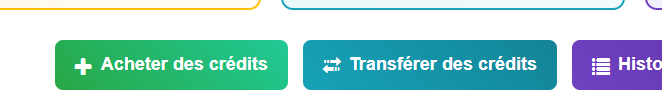
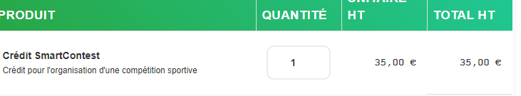
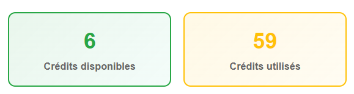
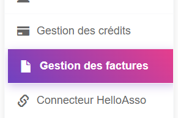

# Acheter des crédits pour organiser une compétition

1. Allez sur la page d'accueil de SmartContest : <https://www.smartcontest.fr/>

2. Connectez-vous à votre compte SmartContest.

      

3. Allez dans **Mes organisations**.

      

4. Cliquez sur **Voir les détails** de votre organisation (votre association ou club)

      

5. Recherchez la section **Gestion des crédits**.

      

6. Cliquez sur **Acheter des crédits**.

      

7. Sélectionnez le nombre de crédits que vous souhaitez acheter.
 
      

8. Cliquez sur **Continuer vers les conditions générales**.

      

9. Vous serez redirigé vers les conditions générales de vente de SmartContest. Lisez-les attentivement, puis cochez la case "J'ai lu et j'accepte les conditions générales de vente de SmartContest".

      

10. Cliquez sur **Continuer vers le paiement**.

      

11. Vous serez redirigé vers la page de paiement. Choisissez votre méthode de paiement et suivez les instructions pour finaliser votre achat.

      

12. Une fois le paiement effectué, vos crédits seront ajoutés à votre compte SmartContest. Vous pouvez vérifier votre solde de crédits dans la section **Gestion des crédits** de votre profil.

      

13. Vous pouvez consulter les factures de vos achats de crédits dans la section **Gestion des factures** de votre profil.

      
