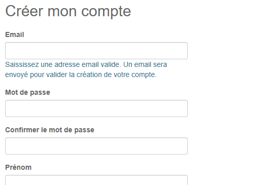
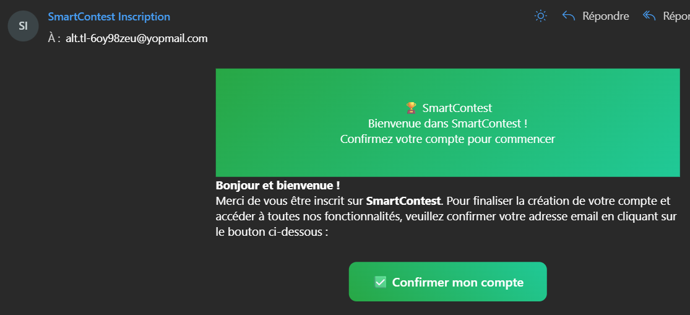

# Créer un compte sur SmartContest

1. Allez sur la page d'accueil de SmartContest : <https://www.smartcontest.fr/>

2. Cliquez sur le bouton **S'inscrire** en haut à droite de la page.

      

3. Remplissez le formulaire d'inscription avec vos informations.

   

4. Cliquez sur "Créer mon compte".

   

5. Vérifiez votre boîte mail et cliquez sur le lien de confirmation.

   

6. Votre compte est maintenant créé ! Vous pouvez vous connecter.

   
