# Créer une compétition

Pour créer une compétition, vous pouvez le faire soit depuis le site web SmartContest, soit depuis l'application SmartContest.
Si vous souhaitez vous entraîner ou découvrir les fonctionnalités de SmartContest, vous pouvez créer une compétition gratuitement en mode démo (1 heure) depuis l'application uniquement.
Sinon, il vous faudra un crédit pour créer une compétition depuis le site web. Vous pouvez acheter des crédits en suivant le guide "Acheter des crédits pour organiser une compétition".

!!! warning  Important
    Lors de la création d'une compétition, le nom de la compétition et la date de début sont obligatoires. Vous pouvez modifier la date de début après la création de la compétition si besoin.

    Si vous avez utilisé un crédit pour créer une compétition, vous pourrez modifier la date de début de votre compétition ou supprimer celle-ci jusqu'à 2 jours avant le début de la compétition.

    Si vous supprimez la compétition avant ce délai, le crédit utilisé pour la création de la compétition sera recrédité sur votre compte SmartContest.
    Passé ce délai, la date de début ne pourra plus être modifiée et votre crédit ne sera pas recrédité.

## Depuis le site web (pour une compétition sur 24 heures)

1. Allez sur la page d'accueil de SmartContest : <https://www.smartcontest.fr/>

2. Connectez-vous à votre compte SmartContest.

      

3. Cliquez sur **Mes évènements**

      

4. Cliquez sur **Créer un évènement**

      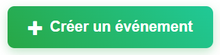

5. Remplissez les informations de votre évènement (titre, description, date, etc.).

      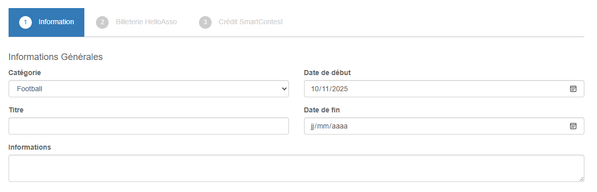

      Le Titre et la date de début sont obligatoires.

6. Cliquez sur **Suivant: Billeterie HelloAsso**.

      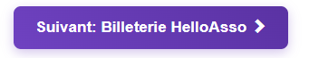

7. Si vous avez associé votre compte HelloAsso à SmartContest, vous pouvez configurer la billetterie de votre évènement.

      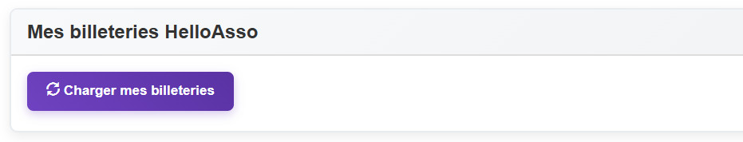

8. Cliquez sur **Suivant: Crédit SmartContest**.

      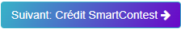

9. Cliquez sur **Charger mes crédits disponibles**.

      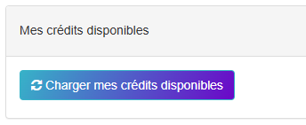

10. Sélectionnez un crédit puis cliquez sur **Associer ce crédit**.

      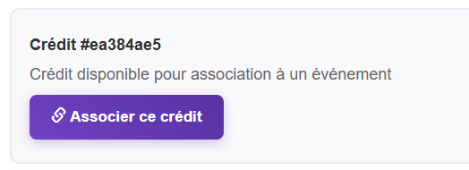

11. Cliquez sur **Enregistrer l'évènement complet**.

      

12. Ouvrez l'application SmartContest.

13. Connectez-vous à votre compte depuis l'application.

      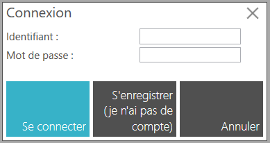

14. Mettez à jour la liste des compétitions en cliquant sur l'icône de rafraîchissement .

15. Votre nouvelle compétition apparaît dans la liste des compétitions (associée à un crédit).

16. Cliquez sur l'icône d'édition de votre compétition pour l'ouvrir et commencer la configuration.

## Depuis l'application SmartContest (pour une compétition en mode démo 1 heure)

1. Ouvrez l'application SmartContest.

2. Depuis la liste des compétitions, cliquez sur **Créer une compétition**.

      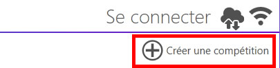

3. Sélectionnez **Démarrer la démo (1 heure)**.

      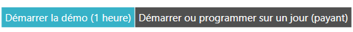

4. Saisissez le nom de la compétition (obligatoire).  

      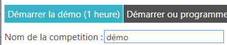

5. Sélectionnez le modèle de compétition (facultatif).  

      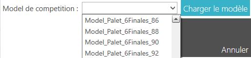

6. Cliquez sur **Créer**. Votre compétition de démonstration est créée et ouverte pour la configuration.

      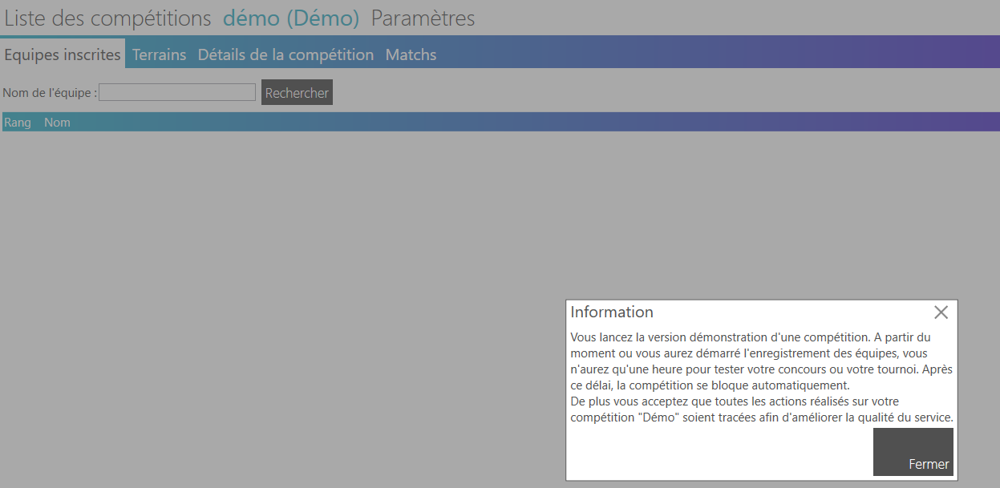

!!! tip Astuce
   Vous pouvez aussi charger votre propre modèle de compétition en cliquant sur **Charger le modèle**.
