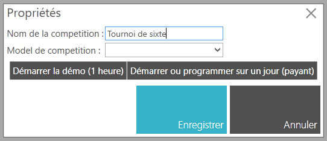

# Créer une compétition

1. Depuis la liste des compétitions cliquer sur "Créer une compétition".

2. Saisir le nom de la compétition (obligatoire)
3. Sélectionnez le modèle de compétition (facultatif)
4. Sélectionner "Démarrer la démo (1 heure)" ou "Démarrer ou programmer sur un jour (payant)"
*Il faut au préalable s'enregistrer et se connecter avec l'application pour avoir l'option "Démarrer ou programmer sur un jour (payant)"*

4.1. Si vous avez sélectionné "Démarrer ou programmer sur un jour (payant)", saisissez la date de début de votre compétition

