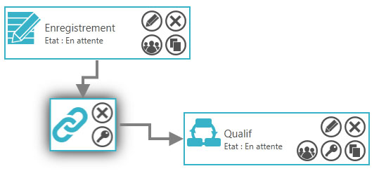

# Construire une compétition

Avec SmartContest, vous pouvez organiser votre concours comme vous le souhaitez. Poules, Qualification, Repechage, Eliminatoire. Tout ou presque est possible. 

## Introduction

Le designer de compétition permet de construire son concours à sa guise.
Il permet de définir le processus du concours avec les poules, les phases de qualification et d'éliminatoire.
Il permet de définir les règles de chaque phase.

## Comment y accéder

1. Créer ou ouvrir une compétition.
2. Cliquer sur **Détails de la compétition**
 

## Démarrage rapide

Avant toute chose, pour que votre concours fonctionne, il faut une phase d'enregistrement des équipes.

### Ajout d'une phase d'enregistrement

1. Réalisez un glisser-déposer de l'icon  sur la zone centrale.
2. Renseigner le nom de cette phase dans la popin puis cliquer sur **Enregistrer**.
 

### Ajout d'une phase de qualification ou d'éliminatoire

1. Pour ajouter une phase de qualification, réalisez un glisser-déposer de l'icon  sur la zone centrale.
 Vous pouvez aussi ajouter une phase d'éliminatoire en realisant un glisser-déposer de l'icon  sur la zone centrale.
 

### Ajout d'un module de liaison

1. Pour permettre aux équipes de passer de la phase d'enregistrement à la phase de qualification, il vous faut ajouter un module de liaison en réalisant un glisser-déposer de l'icon  sur la zone centrale.  
 
2. Avec la souris, cliquez sur une ancre de la phase d'enregistrement et maintenir enfoncé jusqu'à l'ancre du module de liaison.  
 
3. Reproduisez, pour lié le module de liaison et la phase de qualification.
 
4. Définisez les règles pour passer d'une phase à l'autre en cliquant sur l'icon  du module de liaison. Une popin s'ouvre.  
 
5. Cliquez sur **Ajouter une règle**. Une nouvelle popin s'ouvre.  
 
6. Remplissez les champs **Type de sélection**, **Source** et **Destination**. Vous pouvez définir aussi le **Nombre d'équipe à prendre** et le **Nombre d'équipe à passer**.  
 
7. Cliquez sur **Enregistrer**. La popin se referme et la nouvelle règles s'affiche dans la liste des règles du module de liaison.  
 
8. Cliquez sur **Fermer**.

### Configurer une phase de qualification

1. Cliquez sur l'icon  de la phase de Qualification. Une popin s'ouvre.
 
2. Remplissez les champs **Nom de la phase**, **Jouer contre chaque équipe**, **Nombre de tour** et **Publier le classement**.
3. Cliquez sur **Enregistrer**.
4. Cliquez ensuite sur l'icon . Une nouvelle popin s'ouvre.  
 
5. Sur cette popin, vous définissez les règles de classement des équipe dans votre phase. Vous pouvez avoir jusqu'à 4 règles de trie consécutives.  
 En cochant la case **Cumuler le classement avec la précédente phase** Vous prenez en compte (additionné) le nombre de victoire les points pour et contres de la phase précédente pour déterminer le classement de la phase.
 Vous pouvez définir de ne prendre en compte que les X meilleur matchs de chaque équipe pour le classement en cochant la case **Classer sur les meilleurs matchs**.  
 
6. Cliquez sur **Enregistrer**. Une nouvelle popin s'ouvre.  
 
7. Sur cet écran, vous définissez les règles des matchs. Remplissez les différents champs.
 
8. Cliquez sur **Enregistrer**.

### Tester le design de la compétition

1. cliquez sur **Tester la compétition**.  
 
2. Attendez la fin du traitement. Une popin s'ouvre alors et vous informe si votre design de concours est valide ou pas. Vous avez une indication sur le nombre maximum et minimum géré par votre design de concours.
   
  Vous pouvez aussi vérifier les résultat de la simulation sur chacune des phases en cliquant sur l'icon . Une popin s'ouvre et affiche les informations sur le **Nombre d'équipes**, le **Nombre de terrains** et le **Nombre de matchs** nécessaire.  
  

## Les Phases

Il existe 3 type de phases :
+ **Les phases d'enregistrement**  
 Les phases d'enregistrement permettent de définir un point d'entrée à votre concours. C'est d'une phase d'enregistrement que les équipes inscrites vont commencer votre concours. Il est donc nécessaire d'avoir une phase d'enreigrement dans le design de votre concours pour que celui-ci fonctionne.  
+ **Les phases de qualification**  
 Les phases de qualification permettent de faire jouer des équipes entre elles dans cette phases. Elle fonctionne par nombre de tour. Ainsi, si votre phases est configuré pour 3 tour. Chaque équipe à l'intérieur de cette phase jouera 3 matchs. C'est le principe de la poule!
+ **Les phases éliminatoire**  
 Les phases éliminatoire permettent de procéder à l'élimination des équipes avec le principe de quart, demi et finale. Les phases éliminatoires doivent avoir obligatoirement un nombre d'équipes bien précis. A savoir : 64, 32, 16, 8, 4 ou 2 équipes.

### Phase d'enregistrement

### Phase de qualification

### Phase éliminatoire