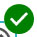
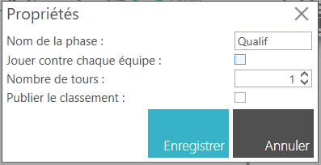

.. SmartContest documentation master file, created by
   sphinx-quickstart on Wed May 30 10:29:49 2018.
   You can adapt this file completely to your liking, but it should at least
   contain the root `toctree` directive.

.. |icon_phaseeliminatoire| image:: img/design-competition/5.jpg
    :width: 20pt
    :height: 20pt    

##########################
Construire une compétition
##########################

Avec SmartContest, vous pouvez organiser votre concours comme vous le souhaitez : poules, qualification, repêchage, éliminatoire. Tout ou presque est possible. 

************
Introduction
************

Le concepteur de compétition permet de construire son concours à sa guise.
Il permet de définir le processus du concours avec les poules, les phases de qualification et d'éliminatoire.
Il permet de définir les règles de chaque phase.

*****************
Comment y accéder
*****************

1. Créez ou ouvrez une compétition.
2. Cliquez sur **Détails de la compétition**
   
   .. image:: img/design-competition/1.jpg

****************
Démarrage rapide
****************

Avant toute chose, pour que votre concours fonctionne, il faut une phase d'enregistrement des équipes.

Ajout d'une phase d'enregistrement
==================================

1. Réalisez un glisser-déposer de l'icône |icon_phaseenregistrement| sur la zone centrale.
2. Renseignez le nom de cette phase dans la fenêtre contextuelle puis cliquez sur **Enregistrer**.
   
   .. image:: img/design-competition/3.jpg

Ajout d'une phase de qualification ou d'éliminatoire
====================================================

1. Pour ajouter une phase de qualification, réalisez un glisser-déposer de l'icône |icon_phasequalif| sur la zone centrale. Vous pouvez aussi ajouter une phase d'éliminatoire en réalisant un glisser-déposer de l'icône |icon_phaseeliminatoire| sur la zone centrale.
   
   .. image:: img/design-competition/6.jpg

Ajout d'un module de liaison
============================

1. Pour permettre aux équipes de passer de la phase d'enregistrement à la phase de qualification, il vous faut ajouter un module de liaison en réalisant un glisser-déposer de l'icône |icon_moduleliaison| sur la zone centrale.  
   
   .. image:: img/design-competition/8.jpg

2. Avec la souris, cliquez sur une ancre de la phase d'enregistrement et maintenez enfoncé jusqu'à l'ancre du module de liaison.  
   
   .. image:: img/design-competition/9.jpg

3. Reproduisez l'opération pour lier le module de liaison et la phase de qualification.
   
   .. image:: img/design-competition/10.jpg

4. Définissez les règles pour passer d'une phase à l'autre en cliquant sur l'icône |icon_regle| du module de liaison. Une fenêtre contextuelle s'ouvre.  
   
   .. image:: img/design-competition/12.jpg
5. Cliquez sur **Ajouter une règle**. Une nouvelle fenêtre contextuelle s'ouvre.  
   
   .. image:: img/design-competition/13.jpg

6. Remplissez les champs **Type de sélection**, **Source** et **Destination**. Vous pouvez définir aussi le **Nombre d'équipes à prendre** et le **Nombre d'équipes à passer**.  
   
   .. image:: img/design-competition/14.jpg

7. Cliquez sur **Enregistrer**. La fenêtre contextuelle se referme et la nouvelle règle s'affiche dans la liste des règles du module de liaison.  
   
   .. image:: img/design-competition/15.jpg

8. Cliquez sur **Fermer**.

Configurer une phase de qualification
=====================================

1. Cliquez sur l'icône |icon_edition| de la phase de qualification. Une fenêtre contextuelle s'ouvre.
   
   .. image:: img/design-competition/17.jpg

2. Remplissez les champs **Nom de la phase**, **Jouer contre chaque équipe**, **Nombre de tours** et **Publier le classement**.

3. Cliquez sur **Enregistrer**.

4. Cliquez ensuite sur l'icône |icon_regle|. Une nouvelle fenêtre contextuelle s'ouvre.  
   
   .. image:: img/design-competition/18.jpg
5. Dans cette fenêtre contextuelle, vous définissez les règles de classement des équipes dans votre phase. Vous pouvez avoir jusqu'à 4 règles de tri consécutives. En cochant la case **Cumuler le classement avec la précédente phase**, vous prenez en compte (additionnez) le nombre de victoires, les points pour et contre de la phase précédente pour déterminer le classement de la phase. Vous pouvez définir de ne prendre en compte que les X meilleurs matchs de chaque équipe pour le classement en cochant la case **Classer sur les meilleurs matchs**.  
   
   .. image:: img/design-competition/19.jpg

6. Cliquez sur **Enregistrer**. Une nouvelle fenêtre contextuelle s'ouvre.  
   
   .. image:: img/design-competition/20.jpg

7. Dans cet écran, vous définissez les règles des matchs. Remplissez les différents champs.
   
   .. image:: img/design-competition/21.jpg

8. Cliquez sur **Enregistrer**.

Tester la conception de la compétition
====================================

1. Cliquez sur **Tester la compétition**.  
   
   .. image:: img/design-competition/22.jpg

2. Attendez la fin du traitement. Une fenêtre contextuelle s'ouvre alors et vous informe si votre conception de concours est valide ou non. Vous avez une indication sur le nombre maximum et minimum géré par votre conception de concours.
   
   .. image:: img/design-competition/23.jpg  

3. Vous pouvez aussi vérifier les résultats de la simulation sur chacune des phases en cliquant sur l'icône |icon_test|. Une fenêtre contextuelle s'ouvre et affiche les informations sur le **Nombre d'équipes**, le **Nombre de terrains** et le **Nombre de matchs** nécessaires.
   
   .. image:: img/design-competition/25.jpg

**********
Les phases
**********

Il existe 3 types de phases :

* **Les phases d'enregistrement**  
  Les phases d'enregistrement permettent de définir un point d'entrée à votre concours. C'est par une phase d'enregistrement que les équipes inscrites vont commencer votre concours. Il est donc nécessaire d'avoir une phase d'enregistrement dans la conception de votre concours pour que celui-ci fonctionne.

* **Les phases de qualification**  
  Les phases de qualification permettent de faire jouer des équipes entre elles dans cette phase. Elles fonctionnent par nombre de tours. Ainsi, si votre phase est configurée pour 3 tours, chaque équipe à l'intérieur de cette phase jouera 3 matchs. C'est le principe de la poule !

* **Les phases éliminatoires**  
  Les phases éliminatoires permettent de procéder à l'élimination des équipes avec le principe de quarts, demies et finale. Les phases éliminatoires doivent avoir obligatoirement un nombre d'équipes bien précis, à savoir : 64, 32, 16, 8, 4 ou 2 équipes.

Phase d'enregistrement
======================

Il n'y a pas de configuration particulière pour cette phase.  
Pour modifier le nom de la phase, cliquez sur l'icône |icon_edition| de la phase d'enregistrement.
Dans la fenêtre contextuelle, saisissez le nom de la phase puis cliquez sur **Enregistrer**.

.. image:: img/design-competition/26.jpg

.. important::
   * Une phase d'enregistrement est forcément au début du processus. Vous ne pouvez donc pas définir cette phase comme sortie dans un module de liaison.
   * Actuellement, seule une phase d'enregistrement est autorisée dans la conception d'une compétition. Vous pouvez ajouter d'autres phases d'enregistrement, mais lors du test de votre conception, une erreur sera signalée.

Phase de qualification
======================

Une phase de qualification est équivalente à une poule. Les équipes se rencontrent et chaque équipe joue un certain nombre de matchs.

Les propriétés
--------------

Pour modifier les propriétés d'une phase de qualification, cliquez sur l'icône |icon_edition|.
Une fenêtre contextuelle d'édition s'affiche :  

Vous pouvez alors :

* modifier le **Nom de la phase**,
* cocher la case **Jouer contre chaque équipe**,
  Dans ce cas, le nombre de matchs à jouer sera égal au nombre d'équipes dans la phase -1.
* modifier le **Nombre de tours**,
  Dans le cas où la case **Jouer contre chaque équipe** est cochée, ce sera alors le **Nombre de matchs par équipe**. Le nombre de matchs à jouer sera égal au nombre d'équipes dans la phase -1 multiplié par le **Nombre de matchs par équipe**.
  Exemple : pour 4 équipes, si le **Nombre de matchs par équipe** est défini à 3, chaque équipe jouera alors (4-1) × 3 = 9 matchs.
* cocher la case **Publier le classement**
  En cochant cette case, vous rendez public le classement. L'effet est immédiat. Cela permet de ne pas rendre public le classement en cours et d'éviter des arrangements (peu sportifs) entre les équipes.

Les règles
----------

Phase éliminatoire
==================