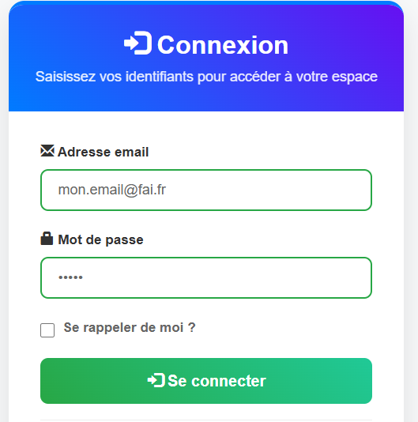
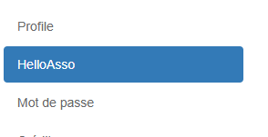

# Lier son compte SmartContest à HelloAsso

!!! warning Important
    Le fait de lier votre compte SmartContest à HelloAsso vous permet d'associer vos billetteries HelloAsso à vos compétitions SmartContest.
    Au moment de l'inscription de vos participants vous pourrez rapatrier automatiquement les informations d'inscription depuis HelloAsso.
    Vous pourrez aussi automatiser l'inscription des participants avec le QR code fourni sur chaque billet HelloAsso.

1. Allez sur la page d'accueil de SmartContest : <https://www.smartcontest.fr/>

2. Connectez-vous à votre compte SmartContest.

   

3. Allez dans "Mon Profil".

   

4. Recherchez la section "HelloAsso".

   

5. Cliquez sur "Connecter à HelloAsso".

   

6. Suivez les instructions pour autoriser la connexion entre SmartContest et HelloAsso.

Une fois lié, vous pourrez associer vos billetteries HelloAsso à vos compétitions SmartContest.