# Concevoir une compétition

Avec SmartContest, vous pouvez organiser votre concours comme vous le souhaitez : poules, qualification, repêchage, éliminatoire. Tout ou presque est possible.

## Introduction

Le concepteur de compétition permet de construire son concours à sa guise.
Il permet de définir le processus du concours avec les poules, les phases de qualification et d'éliminatoire.
Il permet de définir les règles de chaque phase.

## Comment y accéder

1. Créez ou ouvrez une compétition.
2. Cliquez sur **Détails de la compétition**

      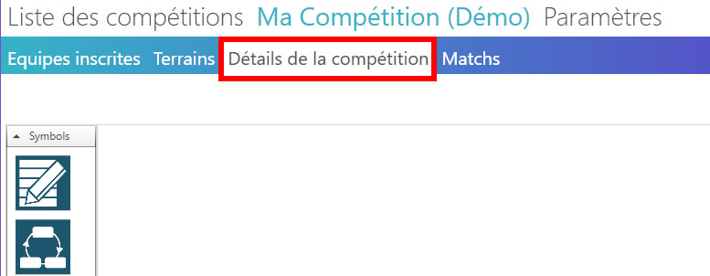

## Démarrage rapide

Avant toute chose, pour que votre concours fonctionne, il faut une phase d'enregistrement des équipes.

### Ajout d'une phase d'enregistrement

1. Réalisez un glisser-déposer de l'icône  sur la zone centrale.
2. Renseignez le nom de cette phase dans la fenêtre contextuelle puis cliquez sur **Enregistrer**.

      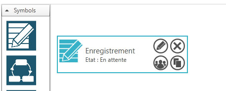

### Ajout d'une phase de qualification ou d'éliminatoire

1. Pour ajouter une phase de qualification, réalisez un glisser-déposer de l'icône  sur la zone centrale. Vous pouvez aussi ajouter une phase d'éliminatoire en réalisant un glisser-déposer de l'icône  sur la zone centrale.

      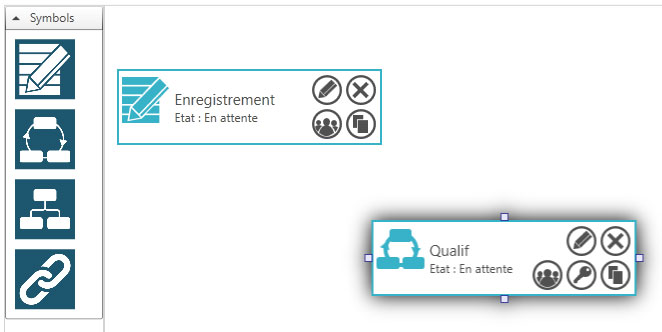

### Ajout d'un module de liaison

1. Pour permettre aux équipes de passer de la phase d'enregistrement à la phase de qualification, il vous faut ajouter un module de liaison en réalisant un glisser-déposer de l'icône  sur la zone centrale.

      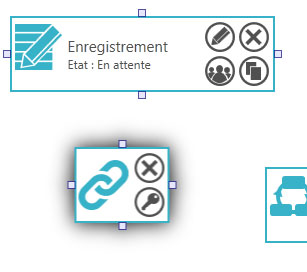

2. Avec la souris, cliquez sur une ancre de la phase d'enregistrement et maintenez enfoncé jusqu'à l'ancre du module de liaison.

      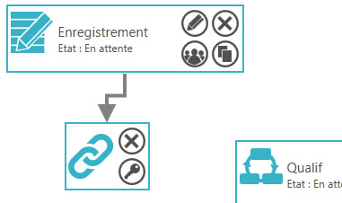

3. Reproduisez l'opération pour lier le module de liaison et la phase de qualification.

      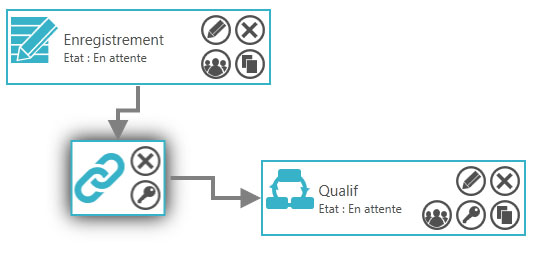

4. Définissez les règles pour passer d'une phase à l'autre en cliquant sur l'icône  du module de liaison. Une fenêtre contextuelle s'ouvre.

      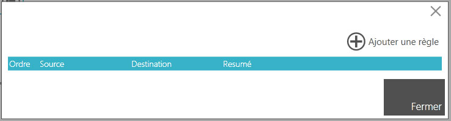

5. Cliquez sur **Ajouter une règle**. Une nouvelle fenêtre contextuelle s'ouvre.

      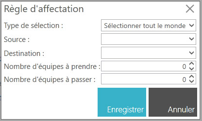

6. Remplissez les champs **Type de sélection**, **Source** et **Destination**. Vous pouvez définir aussi le **Nombre d'équipes à prendre**, le **Nombre d'équipes à passer** et la **catégorie** si nécessaire.

      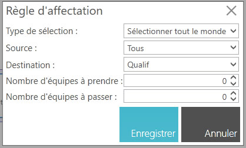

7. Cliquez sur **Enregistrer**. La fenêtre contextuelle se referme et la nouvelle règle s'affiche dans la liste des règles du module de liaison.

      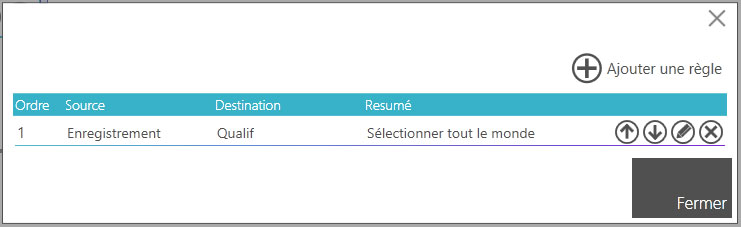

8. Cliquez sur **Fermer**.

!!! info "Les types de sélection"
      Il existe plusieurs types de sélection :

      - **Sélectionner tout le monde** : les équipes de la phase source passent toutes à la phase de destination.
      - **Sélectionner au hasard** : les équipes de la phase source sont sélectionnées au hasard pour passer à la phase de destination. Vous devrez alors préciser le nombre de d'équipes à prendre.
      - **Sélectionner par rapport au classement ascendant** : les équipes les mieux classées de la phase source passent à la phase de destination. Vous devrez alors préciser le nombre de d'équipes à prendre et le nombre d'équipes à passer.
      - **Sélectionner par rapport au classement descendant** : les équipes les moins bien classées de la phase source passent à la phase de destination. Vous devrez alors préciser le nombre de d'équipes à prendre et le nombre d'équipes à passer.
      - **Sélectionner par rapport à un classement ascendant** : les équipes les mieux classées du classement personnalisé source passent à la phase de destination. Vous devrez alors préciser le nombre de d'équipes à prendre et le nombre d'équipes à passer.
      *Astuce : Ce mode de sélection est utile pour faire du repêchage.*
      - **Sélectionner par rapport à un classement descendant** : les équipes les moins bien classées du classement personnalisé source passent à la phase de destination. Vous devrez alors préciser le nombre de d'équipes à prendre et le nombre d'équipes à passer.
      *Astuce : Ce mode de sélection est utile pour faire du repêchage.*
      - **Sélectionner les éliminés** : Cette option est uniquement disponible pour les phases éliminatoires. Les équipes éliminées de la phase source passent à la phase de destination. Vous devrez alors préciser le nombre de d'équipes à prendre.
      - **Sélectionner par rapport à une catégorie** : les équipes de la phase source appartenant à une catégorie spécifique passent à la phase de destination. Vous devrez alors préciser la catégorie concernée et le nombre de d'équipes à prendre.

### Gérer les modèles des rencontres

SmartContest permet de configurer finement le comportement des rencontres/parties/matchs. Vous pouvez définir les règles d'affectations des équipes, les règles de la partie mais aussi définir des sous-rencontres/parties/matchs (manches, sets, donnes, etc.) et pour chacune d'entre elles définir des règles spécifiques.

Pour simplifier la gestion des rencontres/parties/matchs, SmartContest utilise des modèles de rencontre.
Pour ajouter, modifier ou supprimer un modèle de rencontre, cliquez sur  **Gérer les modèles des [rencontres/parties/matchs]**.

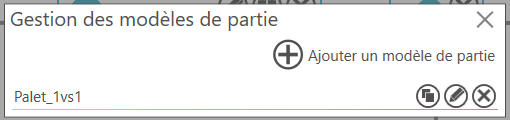

Voici la procédure pour créer ou modifier un modèle de rencontre :

1. Cliquez sur **Ajouter un modèle de [rencontre/partie/match]** ou sur l'icône  pour modifier un modèle existant. Une fenêtre contextuelle s'ouvre.

      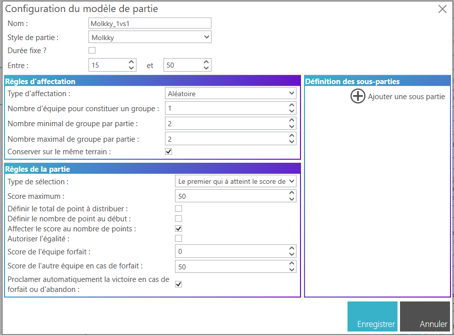

2. Remplissez les champs **Nom** et **Style de partie**.

!!! info
      Le **Style de partie** détermine la façon dont les scores sont saisis et affichés dans l'application mobile SmartContest et au niveau de l'affichage dynamique.

#### Définir les règles d'affectation

Les règles d'affectation permettent de définir combien et comment les équipes sont affectées dans une rencontre/partie/match.

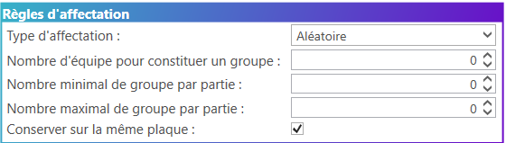

!!! example
      Dans un concours de belote individuel (concours à la mélée), chaque rencontre/partie/match se joue entre 4 joueurs constitué de 2 groupes de 2 joueurs (2 équipes de 2 joueurs). Pour chaque rencontre/partie/match, les groupes de joueurs (équipes) sont affectées aléatoirement.

1. Sélectionnez le **Type d'affectation** dans la liste déroulante.

2. Renseignez le **Nombre d'équipes pour constituer un groupe**.

3. Renseignez le **Nombre minimal de groupes par partie**.

4. Renseignez le **Nombre maximal de groupes par partie**.

5. Cochez la case **Conserver sur la même [plaque/planche/table/terrain]** si vous souhaitez que les équipes restent sur la même aire de compétition. Cette option n'est opérationnel que pour les sous-rencontres/parties/matchs.

!!! info "Les types d'affectation"
      Les types d'affectation disponibles sont les suivants :

      - **Aléatoire** : Les équipes sont affectées dans les groupes de manière aléatoire.
      - **Conserver les affectations** : Cette option n'est opérationnel que pour les sous-rencontres/parties/matchs. Les équipes sont affectées dans les groupes en conservant les affectations de la rencontre/partie/match parente.
      - **Par catégorie** : Les équipes sont affectées dans les groupes en fonction de leur catégorie.
      - **Définit manuelle** : Les équipes sont affectées manuellement par l'organisateur avant le début de la rencontre/partie/match. (pas encore disponible)

#### Définir les règles de la partie

Les règles de la partie permettent de définir comment se déroule une rencontre/partie/match.

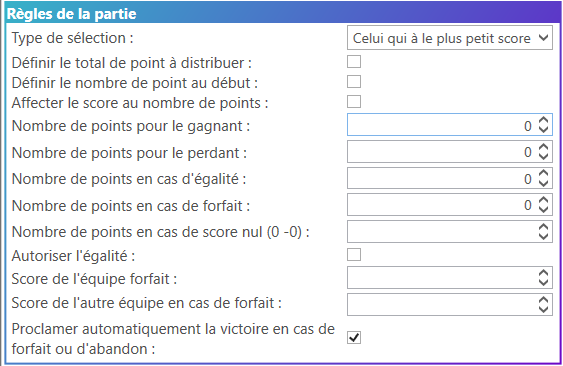

1. Sélectionnez le **Type de sélection** dans la liste déroulante.

2. Cochez la case **Définir le total de point à distribuer** si vous souhaitez que la rencontre/partie/match ait un total de points fixe à se partager entre les groupes d'équipes.

3. Si vous avez coché la case précédente, renseignez le **Total de points à distribuer** et **Nombre maximal de points bonus**.

4. Cochez la case **Définir le nombre de point au début** : si vous souhaitez que chaque groupe d'équipes commence la rencontre/partie/match avec un certain nombre de points.

5. Si vous avez coché la case précédente, renseignez le **Score au début**.

6. Cochez la case **Affecter le score au nombre de points** si vous souhaitez que le score de la rencontre/partie/match soit égal au nombre de points obtenus par chaque groupe d'équipes.

7. Si vous n'avez pas coché la case précédente, renseignez les champs :

   - **Nombre de points pour le gagnant**,
   - **Nombre de points pour le perdant**,
   - **Nombre de points en cas d'égalité** et
   - **Nombre de points en cas de score nul (0-0)**.

8. Cochez la case **Autoriser l'égalité** si vous souhaitez que la rencontre/partie/match puisse se terminer par une égalité.

9. Renseignez le **Score de l'équipe forfait** et le **Score de l'autre équipe en cas de forfait**.

10. Cochez la case **Proclamer automatiquement la victoire en cas de forfait ou d'abandon** si vous souhaitez que la rencontre/partie/match soit automatiquement remportée par l'équipe adverse en cas de forfait ou d'abandon.

!!! info "Les types de sélection"
      Les types de sélection disponibles sont les suivants :

      - **Celui qui à le plus petit score** : La rencontre/partie/match est remportée par le groupe d'équipes ayant le plus petit score.
      - **Celui qui à le plus grand score** : La rencontre/partie/match est remportée par le groupe d'équipes ayant le plus grand score.
      - **celui qui est en dessous de** : La rencontre/partie/match est remportée par le groupe d'équipes qui atteint un score en dessous d'une valeur définie.
      - **Celui qui est au dessus de** : La rencontre/partie/match est remportée par le groupe d'équipes qui atteint un score au dessus d'une valeur définie.
      - **Le premier qui à atteint le score de** : La rencontre/partie/match est remportée par le groupe d'équipes qui atteint en premier un score défini.
      - **Le premier qui à atteint le score de ... avec 2 points d'écarts** : La rencontre/partie/match est remportée par le groupe d'équipes qui atteint en premier un score défini avec au moins 2 points d'écarts par rapport à l'autre groupe d'équipes.

!!! Example "Concours de belote"
      Dans un concours de belote, le score est égal au nombre de points obtenus par chaque équipe. La rencontre est remportée par l'équipe qui a le plus grand score.
      Il faudra alors sélectionner le type de sélection **Celui qui à le plus grand score** et cocher la case **Affecter le score au nombre de points**.

!!! Example "Tournoi de football"
      Dans un tournoi de football, le score n'est pas égal au nombre de points obtenus par chaque équipe. La rencontre est remportée par l'équipe qui a le plus grand nombre de points. Par exemple, une victoire rapporte 3 points, une défaite rapporte 0 point et une égalité rapporte 1 point à chaque équipe.
      Il faudra alors sélectionner le type de sélection **Celui qui à le plus grand score** et ne pas cocher la case **Affecter le score au nombre de points**. Il faudra alors renseigner les champs **Nombre de points pour le gagnant**, **Nombre de points pour le perdant** et **Nombre de points en cas d'égalité**.

#### Ajouter des sous-rencontres/parties/matchs

Les sous-rencontres/parties/matchs permettent de définir des parties internes à une rencontre/partie/match.

!!! Example
      Dans une rencontre de tennis, chaque match est constitué de plusieurs sets. Chaque set est une sous-rencontre de la rencontre principale.

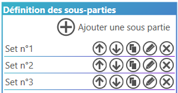

- Vous pouvez ajouter autant de sous-rencontres/parties/matchs que nécessaire en cliquant sur **Ajouter une sous-[rencontre/partie/match]**.
- Vous pouvez ordonner les sous-rencontres/parties/matchs en utilisant les icônes  et .
- Vous pouvez supprimer une sous-rencontre/partie/match en cliquant sur l'icône .
- Vous pouvez cloner une sous-rencontre/partie/match en cliquant sur l'icône .
- Pour chaque sous-rencontre/partie/match, vous pouvez définir les règles d'affectation et les règles de la partie comme pour une rencontre/partie/match principale en cliquant sur l'icône .

### Configurer une phase (de façon générale)

1. Cliquez sur l'icône  de la phase de qualification. Une fenêtre contextuelle s'ouvre.

      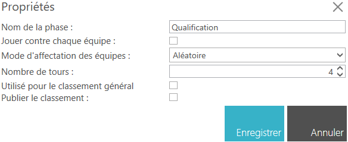

2. Remplissez les champs **Nom de la phase** ainsi que les paramètre spécifiques à la phase.

3. Cliquez sur **Enregistrer**.

4. Cliquez ensuite sur l'icône . Une nouvelle fenêtre contextuelle s'ouvre.

      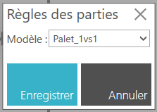

5. Dans cette fenêtre contextuelle, sélectionnez le modèle de rencontre que vous souhaitez utiliser dans cette phase.

6. Cliquez sur **Enregistrer**. Une nouvelle fenêtre contextuelle s'ouvre.

      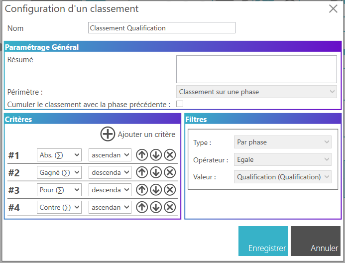

7. Dans cette fenêtre contextuelle, vous définissez les critères de classement des équipes dans votre phase. Vous pouvez avoir autant de critères mais seules les 4 premiers seront visibles sur les affichages. En cochant la case **Cumuler le classement avec la précédente phase**, vous prenez en compte (additionnez) le nombre de victoires, les points pour et contre de la phase précédente pour déterminer le classement de la phase.

      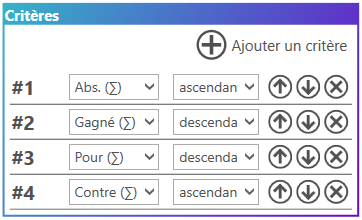

8. Cliquez sur **Enregistrer**.

!!! info "Les critères de classement"
      Les critères de classement disponibles sont les suivants :

      - **Gagné (∑)** : Nombre de victoires
      - **Perdu (∑)** : Nombre de défaites
      - **Pour (∑)** : Somme des scores marqués
      - **Contre (∑)** : Somme des scores encaissés
      - **Diff. (∑)** : Différence entre les scores marqués et encaissés
      - **Points (∑)** : Somme des points attribués selon le modèle de rencontre
      - **Points + Bonus (∑)** : Somme des points attribués selon le modèle de rencontre, y compris les points bonus
      - **Gagné (x̄)** : Moyenne des victoires
      - **Perdu (x̄)** : Moyenne des défaites
      - **Pour (x̄)** : Moyenne des scores marqués
      - **Contre (x̄)** : Moyenne des scores encaissés
      - **Diff. (x̄)** : Moyenne de la différence entre les scores marqués et encaissés
      - **Points (x̄)** : Moyenne des points attribués selon le modèle de rencontre
      - **Points + Bonus (x̄)** : Moyenne des points attribués selon le modèle de rencontre, y compris les points bonus
      - **(Set/Mène/Manche/Donne/Tour) Gagné (∑)** : Somme des sets/mènes/manches/donnes/tours gagnés
      - **(Set/Mène/Manche/Donne/Tour) Perdu (∑)** : Somme des sets/mènes/manches/donnes/tours perdus
      - **(Set/Mène/Manche/Donne/Tour) Pour (∑)** : Somme des scores marqués dans les sets/mènes/manches/donnes/tours
      - **(Set/Mène/Manche/Donne/Tour) Contre (∑)** : Somme des scores encaissés dans les sets/mènes/manches/donnes/tours
      - **(Set/Mène/Manche/Donne/Tour) Diff. (∑)** : Somme de la différence entre les scores marqués et encaissés dans les sets/mènes/manches/donnes/tours
      - **(Set/Mène/Manche/Donne/Tour) Points (∑)** : Somme des points attribués selon le modèle de rencontre dans les sets/mènes/manches/donnes/tours
      - **(Set/Mène/Manche/Donne/Tour) Points + Bonus (∑)** : Somme des points attribués selon le modèle de rencontre, y compris les points bonus dans les sets/mènes/manches/donnes/tours
      - **(Set/Mène/Manche/Donne/Tour) Gagné (x̄)** : Moyenne des sets/mènes/manches/donnes/tours gagnés
      - **(Set/Mène/Manche/Donne/Tour) Perdu (x̄)** : Moyenne des sets/mènes/manches/donnes/tours perdus
      - **(Set/Mène/Manche/Donne/Tour) Pour (x̄)** : Moyenne des scores marqués dans les sets/mènes/manches/donnes/tours
      - **(Set/Mène/Manche/Donne/Tour) Contre (x̄)** : Moyenne des scores encaissés dans les sets/mènes/manches/donnes/tours
      - **(Set/Mène/Manche/Donne/Tour) Diff. (x̄)** : Moyenne de la différence entre les scores marqués et encaissés dans les sets/mènes/manches/donnes/tours
      - **(Set/Mène/Manche/Donne/Tour) Points (x̄)** : Moyenne des points attribués selon le modèle de rencontre dans les sets/mènes/manches/donnes/tours
      - **(Set/Mène/Manche/Donne/Tour) Points + Bonus (x̄)** : Moyenne des points attribués selon le modèle de rencontre, y compris les points bonus dans les sets/mènes/manches/donnes/tours

#### Définir les récompenses de la phase

SmartContest permet de définir des récompenses pour les équipes à la fin d'une phase. Cette fonctionnalité est utile pour attribuer des prix ou des distinctions aux meilleures et aider les organisateurs à gérer les remises de récompenses de manière efficace grâce à l'application mobile SmartContest.

1. Sur la fenêtre de configuration de la phase, cliquez sur l'icône . Une nouvelle fenêtre contextuelle s'ouvre.

      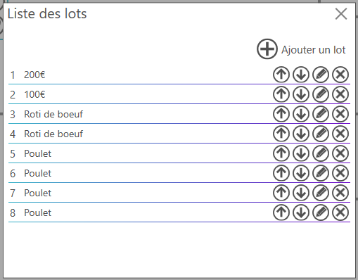

2. Cliquez sur **Ajouter un lot**. Une nouvelle fenêtre contextuelle s'ouvre.

      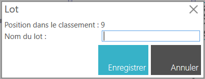

3. Renseignez les champs **Nom du lot** puis **Enregistrer**.

Vous pouvez aussi ordonner les lots en utilisant les icônes  et  ou supprimer un lot en cliquant sur l'icône .

### Gérer les configuration de classement

SmartContest permet de configurer les règles de classement des équipes dans une phase. Vous pouvez définir :

- les critères de classement, tels que le nombre de points, la différence de points, le nombre de victoires, etc.
- les filtres de classement, tels que les phases à inclure ou exclure du classement.
- les regroupements de classement, tels que regrouper les équipes par catégorie.
- ...

Pour ajouter, modifier ou supprimer une configuration de classement, cliquez sur  **Gérer les configurations de classement**.

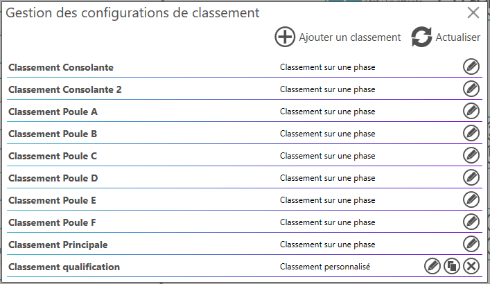

Voici la procédure pour créer ou modifier une configuration de classement :

1. Cliquez sur **Ajouter un classement** ou sur l'icône  pour modifier un classement existant. Une fenêtre contextuelle s'ouvre.

      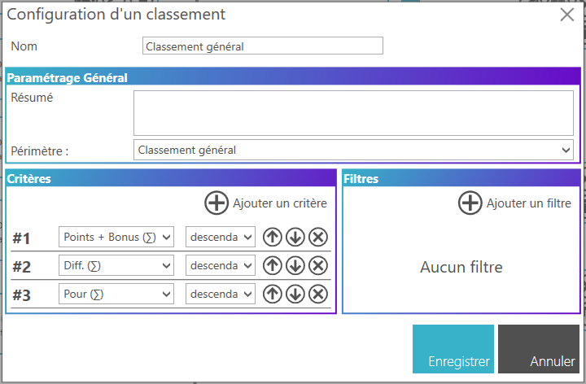

2. Remplissez les champs **Nom**, **Résumé** et **Périmètre**.

   Le **Périmètre** détermine le type de classement auquel la configuration s'applique.
   Il existe 4 types de classement :

   - **Classement sur une phase** : Classement des équipes à l'intérieur d'une phase.
   - **Classement général** : Classement de toutes les équipes de la compétition.
   - **Classement sur plusieurs phases** : Classement des équipes sur plusieurs phases.
   - **Classement personnalisé** : Classement des équipes selon des critères personnalisés définis par l'organisateur.

3. Si vous avez sélectionné le type de classement **Classement personnalisé**, vous pouvez alors cocher **Activer le classement des catégories** ou **Activer le regroupement**.

      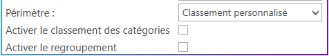

   - L'option **Activer le classement des catégories** permet d'avoir un classement de chaque catégorie. Par exemple, dans un tournoi inter-club, vous pourrez avoir un classement des clubs en plus du classement général.

   - L'option **Activer le regroupement** permet de regrouper les équipes dans le classement par un critère spécifique. Par exemple, dans un tournoi de belote, vous pourrez regrouper les équipes par catégorie (masculin, féminin, mixte) pour avoir un classement de chaque équipe par genre.

4. Configurez les critères de classement et les filtres de classement selon vos besoins.

5. Cliquez sur **Enregistrer**.

!!! note
      Le **Classement sur une phase** est associé à une unique phase. Ce classement ne peut être supprimé que si la phase associée est supprimée. Il n'est pas possible de créer un classement de type **Classement sur une phase** manuellement, il est automatiquement créé lors de la création d'une phase.

#### Définir les critères de classement

Les critères de classement permettent de définir les règles de classement des équipes (ou des catégories). Vous pouvez définir autant de critères que nécessaire, mais seuls les 4 premiers seront visibles sur les affichages.

!!! note
      Lors du classement des équipes, les critères sont appliqués dans l'ordre défini. Par exemple, si vous avez défini comme premier critère le nombre de points, les équipes seront d'abord classées par nombre de points. En cas d'égalité sur ce critère, le deuxième critère sera appliqué pour départager les équipes, et ainsi de suite.

1. Cliquez sur **Ajouter un critère** pour ajouter un critère de classement dans la liste des critères de classement.

2. Sélectionnez le critère (ex : Points (∑)) dans la liste déroulante.

3. Sélectionnez l'ordre de classement (ascendant ou descendant) pour ce critère.
   Par exemple, pour le critère **Points (∑)**, vous pouvez sélectionner un ordre de classement descendant pour que les équipes avec le plus de points soient classées en premier.

!!! info "Les critères de classement"
      Les critères de classement disponibles sont les suivants :

      - **Gagné (∑)** : Nombre de victoires
      - **Perdu (∑)** : Nombre de défaites
      - **Pour (∑)** : Somme des scores marqués
      - **Contre (∑)** : Somme des scores encaissés
      - **Diff. (∑)** : Différence entre les scores marqués et encaissés
      - **Points (∑)** : Somme des points attribués selon le modèle de rencontre
      - **Points + Bonus (∑)** : Somme des points attribués selon le modèle de rencontre, y compris les points bonus
      - **Gagné (x̄)** : Moyenne des victoires
      - **Perdu (x̄)** : Moyenne des défaites
      - **Pour (x̄)** : Moyenne des scores marqués
      - **Contre (x̄)** : Moyenne des scores encaissés
      - **Diff. (x̄)** : Moyenne de la différence entre les scores marqués et encaissés
      - **Points (x̄)** : Moyenne des points attribués selon le modèle de rencontre
      - **Points + Bonus (x̄)** : Moyenne des points attribués selon le modèle de rencontre, y compris les points bonus
      - **(Set/Mène/Manche/Donne/Tour) Gagné (∑)** : Somme des sets/mènes/manches/donnes/tours gagnés
      - **(Set/Mène/Manche/Donne/Tour) Perdu (∑)** : Somme des sets/mènes/manches/donnes/tours perdus
      - **(Set/Mène/Manche/Donne/Tour) Pour (∑)** : Somme des scores marqués dans les sets/mènes/manches/donnes/tours
      - **(Set/Mène/Manche/Donne/Tour) Contre (∑)** : Somme des scores encaissés dans les sets/mènes/manches/donnes/tours
      - **(Set/Mène/Manche/Donne/Tour) Diff. (∑)** : Somme de la différence entre les scores marqués et encaissés dans les sets/mènes/manches/donnes/tours
      - **(Set/Mène/Manche/Donne/Tour) Points (∑)** : Somme des points attribués selon le modèle de rencontre dans les sets/mènes/manches/donnes/tours
      - **(Set/Mène/Manche/Donne/Tour) Points + Bonus (∑)** : Somme des points attribués selon le modèle de rencontre, y compris les points bonus dans les sets/mènes/manches/donnes/tours
      - **(Set/Mène/Manche/Donne/Tour) Gagné (x̄)** : Moyenne des sets/mènes/manches/donnes/tours gagnés
      - **(Set/Mène/Manche/Donne/Tour) Perdu (x̄)** : Moyenne des sets/mènes/manches/donnes/tours perdus
      - **(Set/Mène/Manche/Donne/Tour) Pour (x̄)** : Moyenne des scores marqués dans les sets/mènes/manches/donnes/tours
      - **(Set/Mène/Manche/Donne/Tour) Contre (x̄)** : Moyenne des scores encaissés dans les sets/mènes/manches/donnes/tours
      - **(Set/Mène/Manche/Donne/Tour) Diff. (x̄)** : Moyenne de la différence entre les scores marqués et encaissés dans les sets/mènes/manches/donnes/tours
      - **(Set/Mène/Manche/Donne/Tour) Points (x̄)** : Moyenne des points attribués selon le modèle de rencontre dans les sets/mènes/manches/donnes/tours
      - **(Set/Mène/Manche/Donne/Tour) Points + Bonus (x̄)** : Moyenne des points attribués selon le modèle de rencontre, y compris les points bonus dans les sets/mènes/manches/donnes/tours
      - **Abs. (∑)** : Nombre d'absences
      - **Abs. (x̄)** : Moyenne d'absences
      - **Ordre des phases** : Ordre de classement des équipes selon les phases. Les équipes sont classées en fonction de la phase dans laquelle elles se trouvent.
      *Cette option n'est pas disponible que pour les classements de type **Classement sur une phase**.*
      - **Rang (Phase)** : Rang de l'équipe dans la phase. Les équipes sont classées en fonction de leur rang dans la phase.
      *Cette option n'est pas disponible que pour les classements de type **Classement sur une phase**.*

      Si le critère **Ordre des phases** est sélectionné, vous devez définir l'ordre des phases en cliquant sur l'icône .

      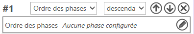

      Une nouvelle fenêtre contextuelle s'ouvre et affiche la liste des phases de la compétition. 
      Sélectionnez les phases que vous souhaitez inclure dans le classement et définissez leur ordre en utilisant les icônes  et .

      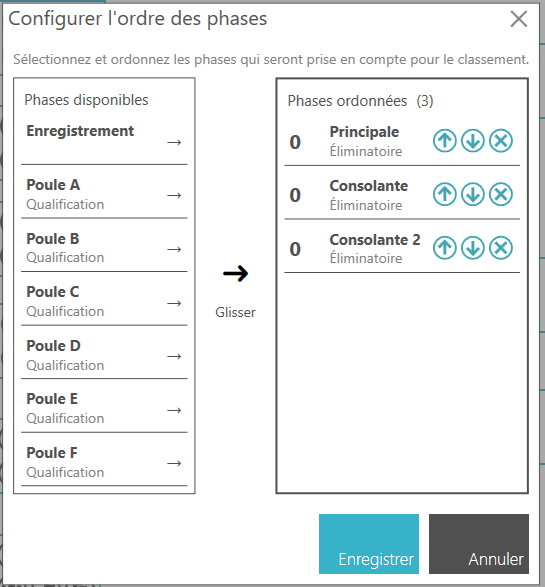

      Cliquez sur **Enregistrer** pour enregistrer l'ordre des phases.

!!! example "Tournoi de football"
      Dans un tournoi de football avec une phase de poule suivie d'une phase éliminatoire, vous pouvez définir les critères de classement de la phase de poule en sélectionnant comme premier critère

      1. le nombre de points (Points (∑)) avec un ordre de classement descendant, puis comme deuxième critère 
      2. la différence de points (Diff. (∑)) avec un ordre de classement descendant, puis comme troisième critère 
      3. le nombre de buts pour (Pour (∑)) avec un ordre de classement descendant, et enfin comme quatrième critère 
      4. le nombre de buts contre (Contre (∑)) avec un ordre de classement ascendant.

!!! example "Tournoi de tennis"
      Dans un tournoi de tennis avec une phase de poule suivie d'une phase éliminatoire, vous pouvez définir les critères de classement de la phase de poule en sélectionnant comme premier critère

      1. le nombre de victoires (Gagné (∑)) avec un ordre de classement descendant, puis comme deuxième critère 
      2. le nombre de sets pour (Pour (∑)) avec un ordre de classement descendant, et enfin comme quatrième critère 
      3. le nombre de sets contre (Contre (∑)) avec un ordre de classement ascendant.
      4. le nombre de jeux pour (Set Pour (∑)) avec un ordre de classement descendant.

#### Définir les filtres de classement

Les filtres de classement permettent de définir un sous-ensemble de données à prendre en compte pour le classement. Par exemple, vous pouvez définir un filtre pour n'inclure que les phases de qualification dans le classement.

1. Cliquez sur **Ajouter un filtre** pour ajouter un filtre de classement dans la liste des filtres de classement.

      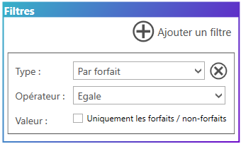

2. Sélectionnez le **Type de filtre** dans la liste déroulante.

3. Sélectionnez l'opérateur du filtre.

4. Sélectionnez la valeur du filtre en fonction du type de filtre sélectionné.
   Par exemple, si vous avez sélectionné le type de filtre **Par phases**, vous pouvez sélectionner les phases à inclure ou exclure du classement.

!!! info "Les types de filtre"
      Les types de filtre disponibles sont les suivants :

      - **Par phases** : Permet de sélectionner les phases à inclure ou exclure du classement.
      - **Par catégories** : Permet de sélectionner les catégories à inclure ou exclure du classement.
      - **Par état** : Permet de sélectionner les états des phases à inclure ou exclure du classement (en cours, terminé, à venir).
      - **Par forfait** : Permet de sélectionner les équipes forfaits à inclure ou exclure du classement.   

!!! info "Les opérateurs de filtre"
      Les opérateurs de filtre disponibles sont les suivants :

      - **Egale** : Seules les données correspondant exactement au critère de filtre seront incluses dans le classement.
      - **Différent** : Les données correspondant exactement au critère de filtre seront exclues du classement.
      - **Inclue** : Seules les données correspondant au critère de filtre seront incluses dans le classement.
      - **Exclue** : Les données correspondant au critère de filtre seront exclues du classement.      

### Tester la conception de la compétition

1. Cliquez sur **Tester la compétition**.

      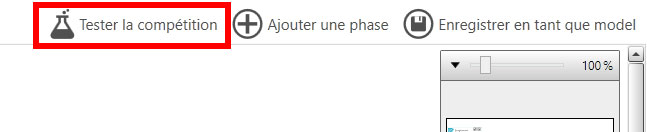

2. Attendez la fin du traitement. Une fenêtre contextuelle s'ouvre alors et vous informe si votre conception de concours est valide ou non. Vous avez une indication sur le nombre maximum et minimum géré par votre conception de concours.

      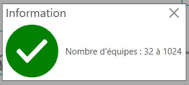

3. Vous pouvez aussi vérifier les résultats de la simulation sur chacune des phases en cliquant sur l'icône . Une fenêtre contextuelle s'ouvre et affiche les informations sur le **Nombre d'équipes**, le **Nombre de terrains** et le **Nombre de matchs** nécessaires.

      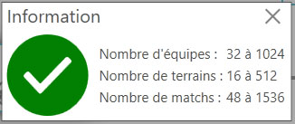

## Les phases

Il existe 3 types de phases :

- **Les phases d'enregistrement**  
  Les phases d'enregistrement permettent de définir un point d'entrée à votre concours. C'est par une phase d'enregistrement que les équipes inscrites vont commencer votre concours. Il est donc nécessaire d'avoir une phase d'enregistrement dans la conception de votre concours pour que celui-ci fonctionne.

- **Les phases de qualification**  
  Les phases de qualification permettent de faire jouer des équipes entre elles dans cette phase. Elles fonctionnent par nombre de tours. Ainsi, si votre phase est configurée pour 3 tours, chaque équipe à l'intérieur de cette phase jouera 3 matchs. C'est le principe de la poule !

- **Les phases de rencontre unique**  
  Les phases de rencontre unique permettent de faire jouer des équipes entre elles une seule fois dans cette phase. C'est utile pour des phases où l'on souhaite que chaque équipe joue une seule fois contre une autre équipe, par exemple pour des matchs amicaux ou des rencontres de classement.

- **Les phases éliminatoires**  
  Les phases éliminatoires permettent de procéder à l'élimination des équipes avec le principe de quarts, demies et finale. Les phases éliminatoires doivent avoir obligatoirement un nombre d'équipes bien précis, à savoir : 64, 32, 16, 8, 4 ou 2 équipes.

### Phase d'enregistrement

Il n'y a pas de configuration particulière pour cette phase.
Pour modifier le nom de la phase, cliquez sur l'icône  de la phase d'enregistrement.
Dans la fenêtre contextuelle, saisissez le nom de la phase puis cliquez sur **Enregistrer**.

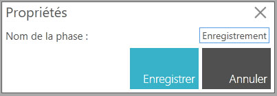

!!! warning Important
    - Une phase d'enregistrement est forcément au début du processus. Vous ne pouvez donc pas définir cette phase comme sortie dans un module de liaison.
    - Actuellement, seule une phase d'enregistrement est autorisée dans la conception d'une compétition. Vous pouvez ajouter d'autres phases d'enregistrement, mais lors du test de votre conception, une erreur sera signalée.

### Phase de qualification

Une phase de qualification est équivalente à une poule. Les équipes se rencontrent et chaque équipe joue un certain nombre de matchs.

#### Les propriétés

Pour modifier les propriétés d'une phase de qualification, cliquez sur l'icône .
Une fenêtre contextuelle d'édition s'affiche :

Vous pouvez alors :

- Modifier le **Nom de la phase**,
- Cocher la case **Jouer contre chaque équipe**,
  Dans ce cas, le nombre de matchs à jouer sera égal au nombre d'équipes dans la phase -1.
- Sélectionnez le **Mode d'affectation des équipes**,

  - **Aléatoire** : Les équipes sont affectées de manière aléatoire dans les rencontres.
  - **Eviter les matchs de la même catégorie** : Les équipes sont affectées dans les rencontres en évitant que des équipes de la même catégorie s'affrontent.
  Si ce n'est pas possible, des équipes de la même catégorie pourront s'affronter.
  - **Interdire les matchs de la même catégorie** : Les équipes sont affectées dans les rencontres en interdisant que des équipes de la même catégorie s'affrontent.
  Si ce n'est pas possible, des équipes seront exemptées de rencontre.

- Modifier le **Nombre de tours**,
  Dans le cas où la case **Jouer contre chaque équipe** est cochée, ce sera alors le **Nombre de matchs par équipe**. Le nombre de matchs à jouer sera égal au nombre d'équipes dans la phase -1 multiplié par le **Nombre de matchs par équipe**.
  Exemple : pour 4 équipes, si le **Nombre de matchs par équipe** est défini à 3, chaque équipe jouera alors (4-1) × 3 = 9 matchs.
- Cocher la case **Publier le classement**
  En cochant cette case, vous rendez public le classement. L'effet est immédiat. Cela permet de ne pas rendre public le classement en cours et d'éviter des arrangements (peu sportifs) entre les équipes.

### Phase de rencontre unique

Une phase de rencontre unique permet de faire jouer des équipes entre elles une seule fois dans cette phase. C'est utile pour des phases où l'on souhaite que chaque équipe joue une seule fois contre une autre équipe, par exemple pour des matchs amicaux ou des rencontres de classement.

#### Les propriétés

Pour modifier les propriétés d'une phase de qualification, cliquez sur l'icône .
Une fenêtre contextuelle d'édition s'affiche :

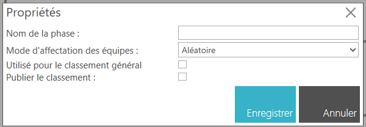

Vous pouvez alors :

- Modifier le **Nom de la phase**,
- Sélectionnez le **Mode d'affectation des équipes**,

  - **Aléatoire** : Les équipes sont affectées de manière aléatoire dans la rencontre.
  - **Le premier contre le dernier** : Les équipes sont affectées dans les rencontres en opposant la meilleure équipe contre la moins bonne équipe, la deuxième meilleure contre la deuxième moins bonne, etc. en se basant sur le classement de la phase précédente.
  - **Le premier contre le milieu** : Les équipes sont affectées dans les rencontres en opposant la meilleure équipe contre une équipe du milieu de tableau, la deuxième meilleure contre la deuxième équipe du milieu de tableau, etc. en se basant sur le classement de la phase précédente.
  - **Le premier contre le second** : Les équipes sont affectées dans les rencontres en opposant la meilleure équipe contre la deuxième meilleure équipe, la troisième contre la quatrième, etc. en se basant sur le classement de la phase précédente.
  - **Eviter les matchs de la même catégorie** : Les équipes sont affectées dans les rencontres en évitant que des équipes de la même catégorie s'affrontent.
  Si ce n'est pas possible, des équipes de la même catégorie pourront s'affronter.
  - **Interdire les matchs de la même catégorie** : Les équipes sont affectées dans les rencontres en interdisant que des équipes de la même catégorie s'affrontent.
  Si ce n'est pas possible, des équipes seront exemptées de rencontre.
  - **Favoriser les matchs de la même catégorie** : Les équipes sont affectées dans les rencontres en favorisant que des équipes de la même catégorie s'affrontent.
  Si ce n'est pas possible, des équipes de catégorie différentes pourront s'affronter.
  - **Obliger les matchs de la même catégorie** : Les équipes sont affectées dans les rencontres en obligeant que des équipes de la même catégorie s'affrontent.
  Si ce n'est pas possible, des équipes seront exemptées de rencontre.

- Cocher la case **Publier le classement**
  En cochant cette case, vous rendez public le classement. L'effet est immédiat. Cela permet de ne pas rendre public le classement en cours et d'éviter des arrangements (peu sportifs) entre les équipes.

### Phase éliminatoire

Une phase éliminatoire permet de procéder à l'élimination des équipes avec le principe de quarts, demies et finale. Les phases éliminatoires doivent avoir obligatoirement un nombre d'équipes bien précis, à savoir : 64, 32, 16, 8, 4 ou 2 équipes.

#### Les propriétés

Pour modifier les propriétés d'une phase de qualification, cliquez sur l'icône .
Une fenêtre contextuelle d'édition s'affiche :

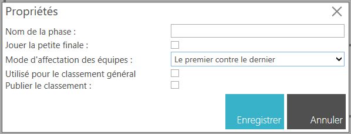

Vous pouvez alors :

- Modifier le **Nom de la phase**,
- Cocher la case **Jouer la petite finale** si vous souhaitez qu'une rencontre pour la troisième place soit jouée entre les deux équipes éliminées en demi-finale.
- Sélectionnez le **Mode d'affectation des équipes**,

  - **Aléatoire** : Les équipes sont affectées de manière aléatoire dans la rencontre.
  - **Le premier contre le dernier** : Les équipes sont affectées dans les rencontres en opposant la meilleure équipe contre la moins bonne équipe, la deuxième meilleure contre la deuxième moins bonne, etc. en se basant sur le classement de la phase précédente.
  - **Le premier contre le milieu** : Les équipes sont affectées dans les rencontres en opposant la meilleure équipe contre une équipe du milieu de tableau, la deuxième meilleure contre la deuxième équipe du milieu de tableau, etc. en se basant sur le classement de la phase précédente.
  - **Le premier contre le second** : Les équipes sont affectées dans les rencontres en opposant la meilleure équipe contre la deuxième meilleure équipe, la troisième contre la quatrième, etc. en se basant sur le classement de la phase précédente.
  - **Eviter les matchs de la même catégorie** : Les équipes sont affectées dans les rencontres en évitant que des équipes de la même catégorie s'affrontent.
  Si ce n'est pas possible, des équipes de la même catégorie pourront s'affronter.
  - **Interdire les matchs de la même catégorie** : Les équipes sont affectées dans les rencontres en interdisant que des équipes de la même catégorie s'affrontent.
  Si ce n'est pas possible, des équipes seront exemptées de rencontre.
  - **Favoriser les matchs de la même catégorie** : Les équipes sont affectées dans les rencontres en favorisant que des équipes de la même catégorie s'affrontent.
  Si ce n'est pas possible, des équipes de catégorie différentes pourront s'affronter.
  - **Obliger les matchs de la même catégorie** : Les équipes sont affectées dans les rencontres en obligeant que des équipes de la même catégorie s'affrontent.
  Si ce n'est pas possible, des équipes seront exemptées de rencontre.

- Cocher la case **Publier le classement**
  En cochant cette case, vous rendez public le classement. L'effet est immédiat. Cela permet de ne pas rendre public le classement en cours et d'éviter des arrangements (peu sportifs) entre les équipes.