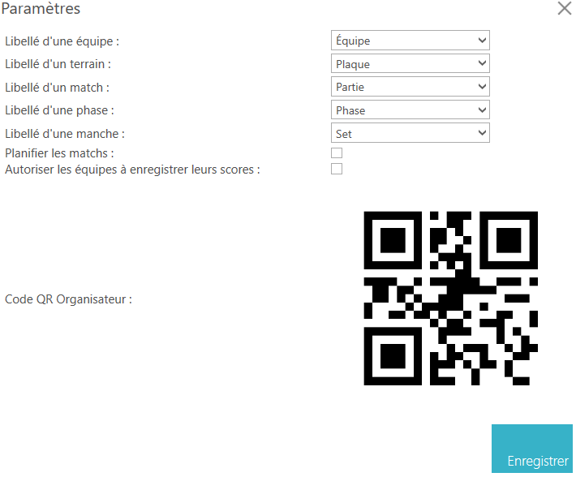

# Configuration générale

La configuration générale d'une compétition dans SmartContest permet de définir les paramètres globaux d'une compétition.

Vous pouvez configurer les éléments suivants :

- Le libellé d'une équipe (par exemple "Club", "Équipe", "Joueur", etc.),
- Le libellé d'une aire de compétition (par exemple "Terrain", "Table", "Planche", etc.),
- Le libellé d'un match (par exemple "Match", "Rencontre", "Partie", etc.),
- Le libellé d'une série de matchs (par exemple "Phase", "Étape", "Round", etc.),
- Activer ou désactiver la planification des matchs,

Pour y accéder, cliquez sur  dans le menu de gestion de votre compétition.

Modifiez les paramètres selon vos besoins, puis cliquez sur "Enregistrer" pour appliquer les changements.

!!! info
    C'est ici aussi que vous trouverez le QR Organisateurs qui vous permettra d'utiliser l'application mobile SmartContest en tant qu'organisateur.
