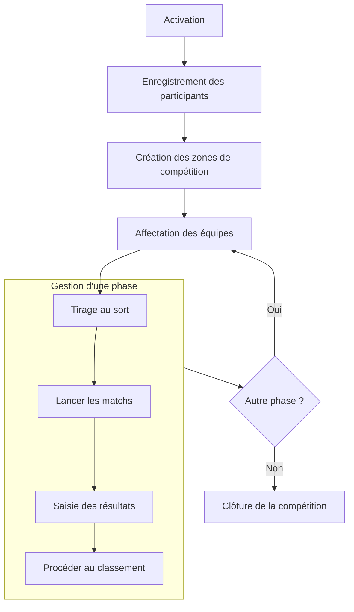

# Gestion d'une compétition

Cette section de la documentation vous guide à travers les différentes étapes de la gestion de votre compétition à l'aide de SmartContest. Vous y trouverez des instructions détaillées sur la configuration, la gestion des participants, la planification des épreuves, et bien plus encore.

Dans smartcontest, une compétition se déroule selon le flux suivant :

## Sections disponibles

- [Configuration générale](general-configuration.md)
- [Gérer les zones](manage-area.md)
- [Gérer les participants](manage-participant.md)
- [Gérer les matchs](manage-contest.md)
- [Concevoir une compétition](design-competition.md)
