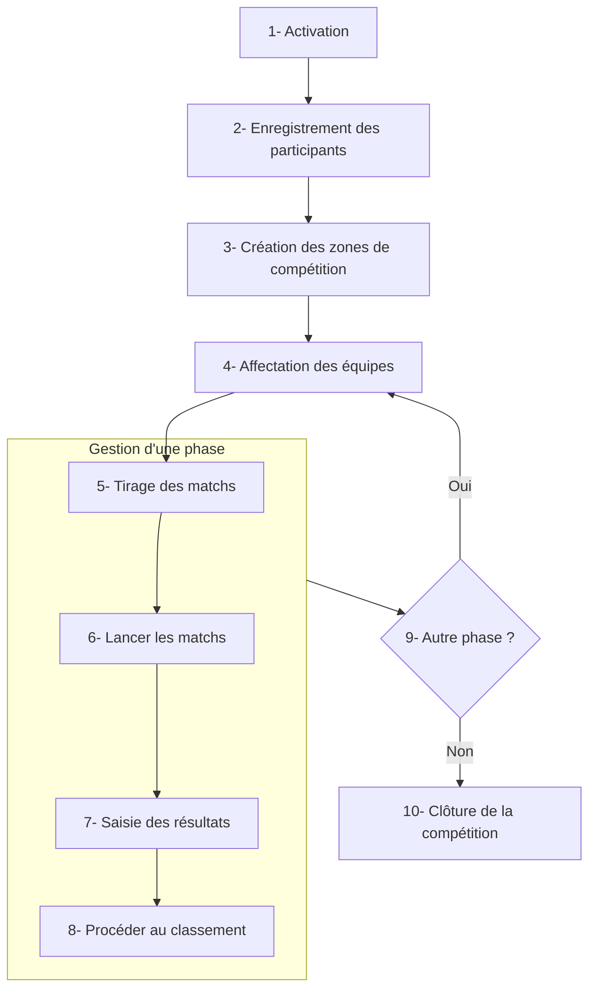

# Gestion d'une compétition

Cette section de la documentation vous guide à travers les différentes étapes de la gestion de votre compétition à l'aide de SmartContest. Vous y trouverez des instructions détaillées sur la configuration, la gestion des participants, la planification des épreuves, et bien plus encore.

Dans smartcontest, une compétition se déroule selon le flux suivant :

## 1- Activation

Avant de pouvoir gérer une compétition, celle-ci doit être activée. L'activation permet de démarrer le processus d'inscription des participants et de configuration des paramètres de la compétition.
Cette étape n'est requise que dans le cas d'une compétition de 24 heures.

!!! warning Important
    L'activation doit obligatoirement se faire depuis l'application SmartContest connecté à internet la veille ou le jour de la compétition.

## 2- Enregistrement des participants

Une fois votre compétition activée, vous pouvez commencer à enregistrer les participants.
Pour plus de détails sur cette étape, consultez la section [Gérer les participants](manage-participant.md).

## 3- Gestion des zones de compétition

Les zones de compétition représentent les différents emplacements où se dérouleront les épreuves de votre compétition (terrains, tables, etc.).
Vous devez obligatoirement créer au moins une zone de compétition avant de pouvoir lancer les matchs.
Pour plus de détails sur cette étape, consultez la section [Gérer les zones](manage-area.md).

## 4- Affectation des équipes

Avant de lancer les matchs, vous devez affecter chaque équipe à une phase de la compétition.
Cette étape est essentielle pour organiser les rencontres entre les équipes.

Il existe trois type de phases :

- **Les poules** (ou phases de qualification) où les équipes s'affrontent plusieurs fois selon un nombre de tours défini,
- **Les éliminatoires** où les équipes s'affrontent en mode "élimination directe",
- **Les rencontres uniques** où les équipes s'affrontent une seule fois.

Pour plus de détails sur les types de phases, consultez la section [Concevoir une compétition](design-competition.md).

## 5- Tirage des matchs

Une fois les équipes affectées aux différentes phases, vous pouvez procéder au tirage des matchs.
Cette étape génère automatiquement les rencontres entre les équipes selon les règles définies dans la conception de la compétition.

## 6- Lancer les matchs

Après le tirage des matchs, vous pouvez lancer les rencontres.
Cette étape permet de débuter les épreuves et de suivre l'avancement des matchs en temps réel.
Pour chaque match lancé une zone de compétition est attribuée automatiquement.

!!! note
    Si le planning est activé dans la configuration générale de la compétition, les matchs seront automatiquement planifiés sur les différentes zones de compétition disponibles.

!!! note
    Si le nombre de terrains est insuffisant pour lancer tous les matchs prévus, les matchs en attente seront mis en file d'attente et pourront être lancés dès qu'un terrain se libère.

## 7- Saisie des résultats

Une fois les matchs terminés, vous devez saisir les résultats.
Cette étape est cruciale pour mettre à jour le classement et permettre la progression de la compétition.
A chaque saisie de résultat, le terrain utilisé pour le match est libéré.

!!! note
    S'il y a des matchs en attente dans la file d'attente, l'application proposera automatiquement de lancer un match sur le terrain libéré.

## 8- Procéder au classement

Après la saisie des résultats, vous pouvez procéder au classement des équipes.
Cette étape calcule les positions des équipes en fonction des résultats obtenus lors des matchs.

Lorsque tous les matchs d'une phase sont terminés, celle-ci est clôturée automatiquement.

## 9- Autre phase ?

Si à la fin de la phase actuelle, il y a une ou plusieurs phases à suivre, l'application propose alors d'affecter les équipes aux nouvelles phases (cf. 4- Affectation des équipes).
Sinon, votre compétition se clôture.

## Sections disponibles

- [Configuration générale](general-configuration.md)
- [Gérer les zones](manage-area.md)
- [Gérer les participants](manage-participant.md)
- [Gérer les matchs](manage-contest.md)
- [Concevoir une compétition](design-competition.md)
- [Gérer les affichages](manage-display.md)