# Gérer les matchs

Dans cette section, vous apprendrez à gérer les matchs de votre compétition, y compris la création, la modification et la suppression des matchs.
Vous verrez comment saisir un score, attribuer un terrain ou modifier la planification d'un match.

## Rechercher un match

!!! info
    En fonction de la configuration de votre compétition, cette section peut être nommée "Matchs", "Rencontres", "Parties", etc.

1. Accédez à la section "Matchs" dans le menu de gestion de votre compétition.

    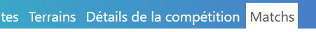

2. Utilisez la barre de recherche ainsi que le filtre d'état (En cours, A venir, En attente ou Terminée) pour trouver un match spécifique en saisissant des critères tels que le nom de l'équipe ou son numéro.

    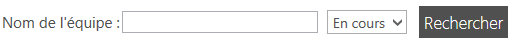

!!! tip Astuce
    Si vous utilisez les QR code durant votre compétition, vous pouvez scanner le QR code d'une équipe pour retrouver rapidement le match en cours de cette équipe.

## Saisir le score d'un match

1. Dans la liste des matchs, localisez celui pour lequel vous souhaitez saisir un score.

    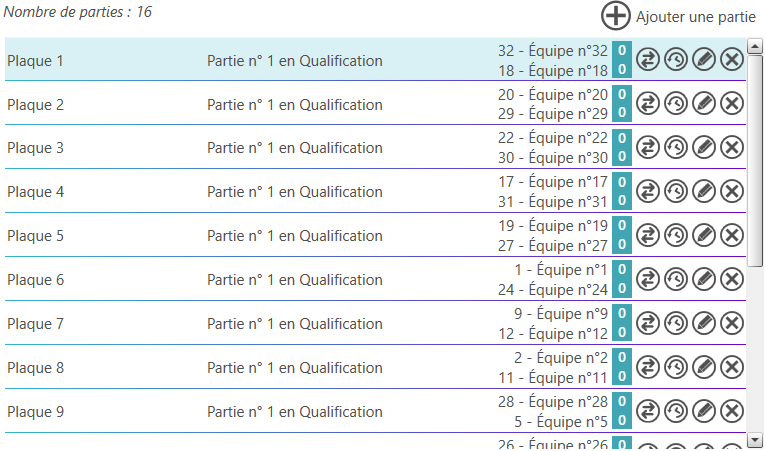

2. Cliquez sur  ou appuyez sur la touche **Entrée** de votre clavier.

3. Saisissez le score pour chaque équipe.

    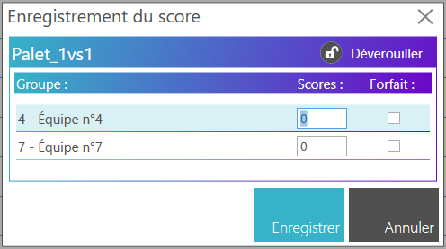

    Vous pouvez indiquer si l'une des 2 équipes était absente en cochant la case "Absent".

    La saisie des scores est soumise aux règles de saisie définies dans la configuration de votre compétition (cf. [configuration des scores](configure-score.md)). Cependant, vous pouvez déverrouiller la saisie en cliquant sur l'icône  pour forcer la saisie d'un score non conforme aux règles définies. Dans ce cas, vous devrez définir quelle équipe est déclarée gagnante du match.

    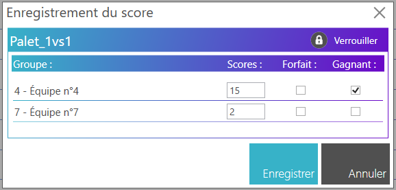

4. Cliquez sur **Enregistrer** pour valider la saisie.

### Saisie d'un score de le cas d'une rencontre avec des sous-matches

Dans le cas où une rencontre est composée de plusieurs sous-matches (par exemple dans le cadre d'une compétition de tennis en double), la saisie des scores se fait en plusieurs étapes :

1. Dans la liste des matchs, localisez celui pour lequel vous souhaitez saisir un score.

    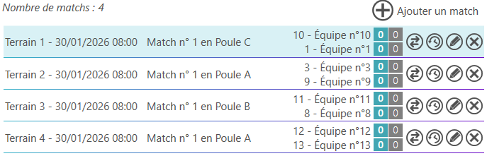

2. Cliquez sur  ou appuyez sur la touche **Entrée** de votre clavier.

3. Saisissez le score pour chaque sous-match.

    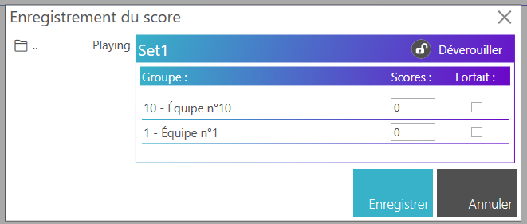

4. Cliquez sur **Enregistrer** pour valider la saisie des sous-matches.

Une fois tous les sous-matches saisis, vous revenez à la racine du match où vous pouvez voir le score global de la rencontre.

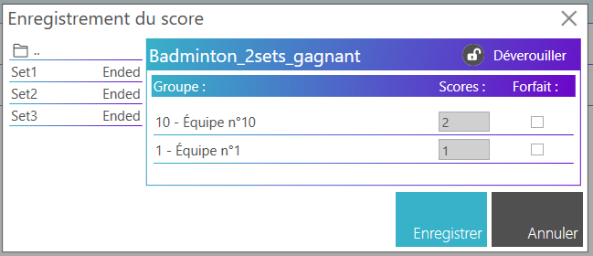

Vous pouvez ainsi modifier le score global si nécessaire en cliquant sur  ou appuyez sur la touche **Entrée** de votre clavier.

Vous pouvez aussi modifier la saisie d'un sous-match en cliquant sur le nom du sous-match dans le menu de navigation à gauche.

## Modifier la saisie d'un score

1. Dans la liste des matchs, localisez celui pour lequel vous souhaitez modifier la saisie d'un score en prenant soin de modifier le filtre sur **Terminés**.

    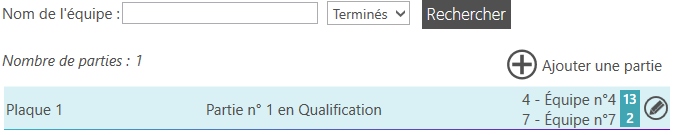

2. Cliquez sur  ou appuyez sur la touche **Entrée** de votre clavier.

3. Modifiez le score pour chaque équipe.

    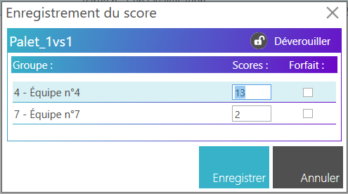

4. Cliquez sur **Enregistrer** pour valider la saisie.

## Modifier le terrain d'un match

!!! note
    La modification du terrain d'un match ne peut se faire que si le match n'est pas terminé.

1. Dans la liste des matchs, localisez celui pour lequel vous souhaitez modifier le terrain.

    

2. Cliquez sur 

3. Sélectionnez le nouveau terrain dans la liste déroulante.

    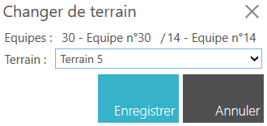

4. Cliquez sur **Enregistrer** pour valider la modification.

## Modifier la planification d'un match

!!! note
    La modification de la planification d'un match ne peut se faire que si le match n'est pas terminé et si la planification est activée dans les paramètres de votre compétition (cf. [configuration générale](general-configuration.md)).

1. Dans la liste des matchs, localisez celui pour lequel vous souhaitez modifier la planification.

    

2. Cliquez sur 

    TODO: Add image showing date and time selection

3. Sélectionnez la nouvelle date et l'heure du match.

4. Cliquez sur **Enregistrer** pour valider la modification.

## Supprimer un match

!!! warning Attention
    Cette action est irréversible. Assurez-vous de vouloir supprimer ce match avant de confirmer l'action.

!!! note
    La suppression d'un match ne peut se faire que si le match n'est pas terminé.

1. Dans la liste des matchs, localisez celui que vous souhaitez supprimer.

    

2. Cliquez sur  pour supprimer le match.

## Ajouter un match manuel

!!! note
    L'ajout d'un match n'est possible que si 2 équipes n'ont actuellement pas de match en cours.

!!! warning Attention
    Cette fonctionnalité n'est disponible que pour les rencontres en 1 contre 1.

1. Accédez à la section "Matchs" dans le menu de gestion de votre compétition.

    

2. Cliquez sur le bouton "Ajouter un match".

    

3. Sélectionnez les 2 équipes participantes.

    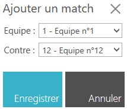

4. Cliquez sur **Enregistrer** pour valider l'ajout du match.