# Gérer les affichages

Dans cette section, vous apprendrez à gérer les affichages durant votre compétitions : Les classmeents, les équipes, les matchs, ... Vous verrez comment configurer les affichages et les diffuser pour offrir une expérience optimale à vos participants et spectateurs.

## Gérer les impressions

SmartContest vous permet d'imprimer différents éléments de votre compétition, tels que les listes d'équipes, les feuilles de match, les classements, etc.

Accédez à la section **Impression** en cliquant sur l'icône .
Une fenetre s'ouvre avec les différents éléments que vous pouvez imprimer.

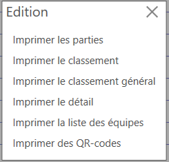

### Imprimer les parties

Pour imprimer les parties, cliquez sur le bouton **Imprimer les parties**. Vous pouvez choisir d'imprimer les parties d'une phase spécifique ou de toutes les phases de la compétition.

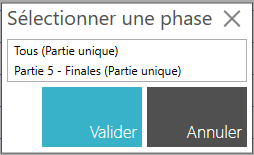

Cliquez sur **Valider** pour générer le PDF des parties à imprimer.

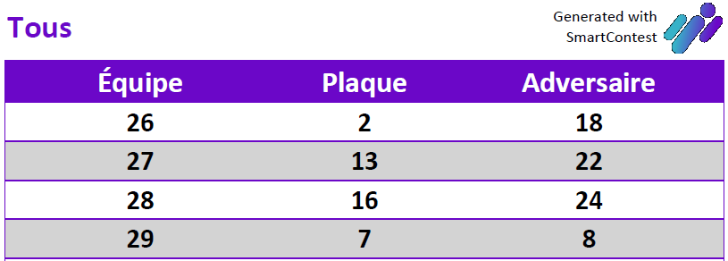

### Imprimer le classement

Pour imprimer le classement général de la compétition, cliquez sur le bouton **Imprimer le classement**. Vous pouvez choisir d'imprimer un ou plusieurs classements à la fois.

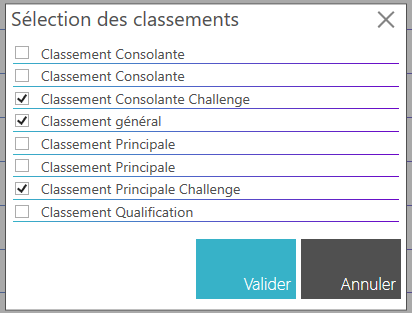

Cliquez sur **Valider** pour générer le PDF des classements à imprimer.

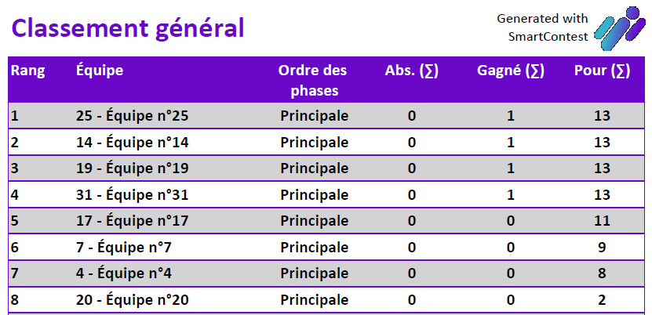

### Imprimer le classement général

Pour imprimer le classement général de la compétition, cliquez sur le bouton **Imprimer le classement général**.

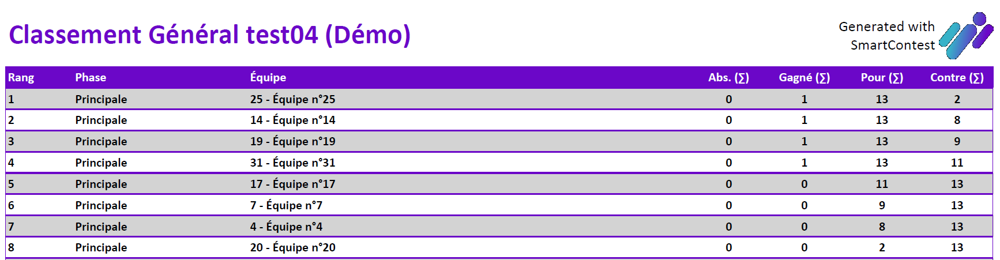

### Imprimer le détail

Pour imprimer le détail d'une phase, cliquez sur le bouton **Imprimer le détail**. Vous devez sélectionner la phase dont vous souhaitez imprimer le détail.

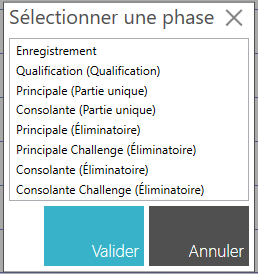

Cliquez sur **Valider** pour générer le PDF du détail de la phase à imprimer.

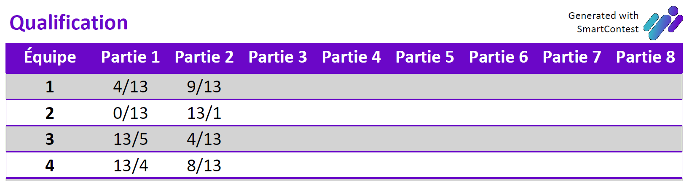

### Imprimer la liste des équipes

Pour imprimer la liste des équipes, cliquez sur le bouton **Imprimer la liste des équipes**.

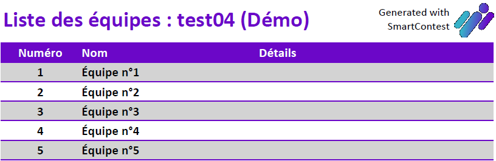

### Imprimer des QR-codes

Pour imprimer les QR-codes des équipes, cliquez sur le bouton **Imprimer les QR-codes**.

Vous pouvez choisir d'imprimer les QR-codes de chaque équipe déjà enregistrée ou imprimer un lot de QR-codes pour ensuite les assoicer aux équipes lors de leur enregistrement.

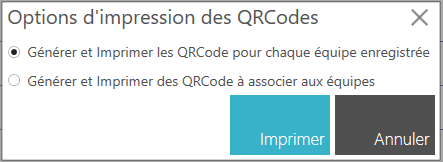

Si vous choisissez d'imprimer les QR-codes de chaque équipe déjà enregistrée, cliquez sur **Valider** pour générer le PDF des QR-codes à imprimer.

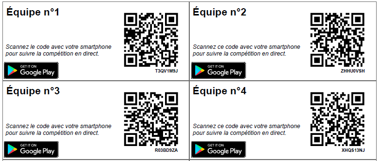

Si vous choisissez d'imprimer un lot de QR-codes, saisissez les numéro des QR-codes à imprimer puis cliquez sur **Valider** pour générer le PDF des QR-codes à imprimer.

Par exemple,

- si vous saisissez "1-10", vous obtiendrez un PDF avec les QR-codes numérotés de 1 à 10 que vous pourrez ensuite associer aux équipes lors de leur enregistrement.
- si vous saisissez "1-10;13;14", vous obtiendrez un PDF avec les QR-codes numérotés de 1 à 10 ainsi que les QR-codes numérotés 13 et 14 que vous pourrez ensuite associer aux équipes lors de leur enregistrement.

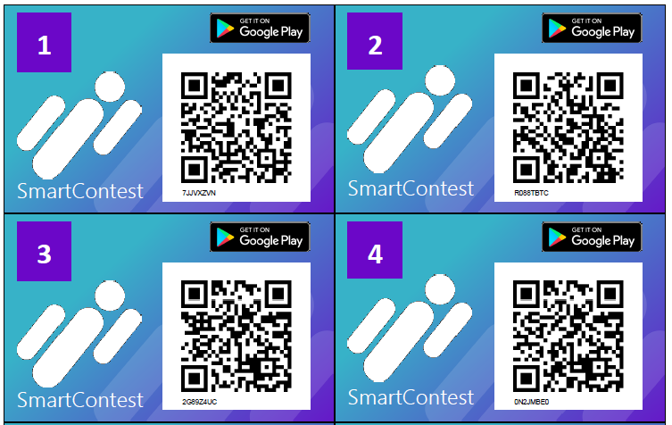

!!! note
    Les QR-codes sont générés avec un numéro unique qui peut être associé à une équipe lors de son enregistrement. Cela permet aux équipes de suivre facilement leur progression dans la compétition en scannant leur QR-code avec leur smartphone.

## Gérer l'affichage dynamique (affichage secondaire)

SmartContest vous permet de diffuser un affichage dynamique (affichage secondaire) pour offrir une expérience immersive à vos participants en utilisant un écran dédié ou un projecteur.

Accédez à la section **Affichage dynamique** en cliquant sur l'icône .
Une fenetre s'ouvre avec les différents éléments que vous pouvez afficher.

Cochez la case **Afficher sur un écran secondaire** pour activer la diffusion de l'affichage dynamique.

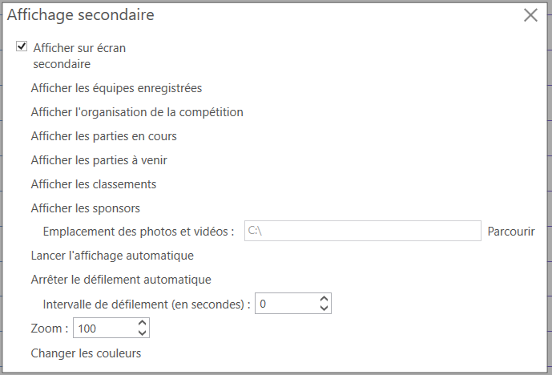

Une deuxième fenêtre s'ouvrira automatiquement sur votre écran secondaire ou votre projecteur.

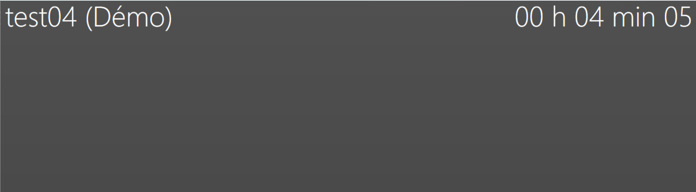

!!! note
    - Vous pouvez faire glisser la fenêtre de l'affichage dynamique sur votre écran secondaire ou votre projecteur pour la positionner comme vous le souhaitez.
    - Vous pouvez passer en plein écran sur votre écran secondaire ou votre projecteur pour une expérience immersive en appuyant simultanément sur les touches **CTRL + F** de votre clavier.

L'affichage dynamique se met à jour automatiquement en temps réel pour refléter les changements dans votre compétition, tels que les scores des matchs, les classements, les équipes, etc.
Vous pouvez afficher :

- Les équipes enregistrés
- Les matchs en cours
- L'organisation de la compétition
- Les classements
- Les sponsors

Vous pouvez personnaliser l'affichage dynamique en configurant :

- La vitesse de défilement des éléments affichés.
    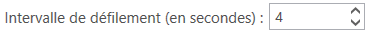

- Le zoom de l'affichage.
    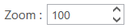

- Les couleurs de l'affichage.
    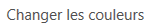

Vous pouvez aussi :

- **Arrêter le défilement automatique**,
- **Avancer manuellement le défilement** et
- **Relancer le défilement automatique**.

### Afficher les équipes enregistrées

Cliquez sur le bouton **Afficher les équipes enregistrées** pour afficher la liste des équipes déjà enregistrées dans votre compétition.

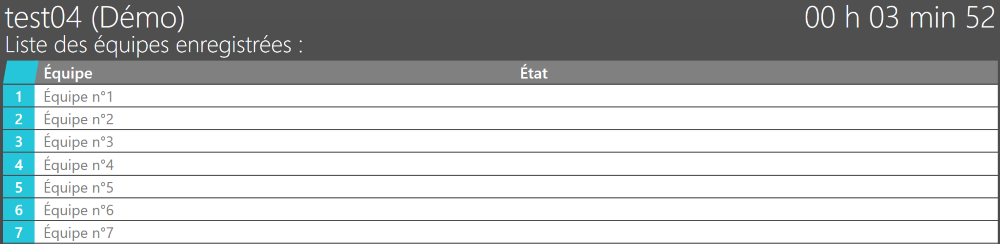

### Afficher l'organisation de la compétition

Cliquez sur le bouton **Afficher l'organisation de la compétition** pour afficher l'organisation de votre compétition.

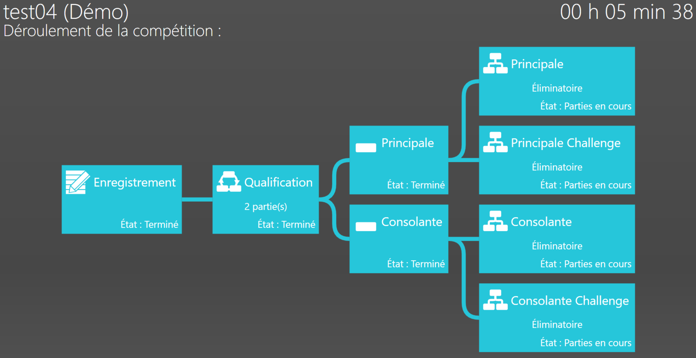

### Afficher les matchs en cours

Cliquez sur le bouton **Afficher les [matchs/parties/rencontres] en cours** pour afficher la liste des matchs en cours dans votre compétition.

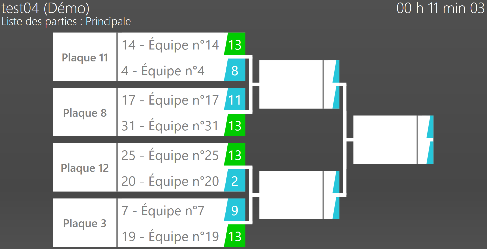

### Afficher les classements

1. Cliquez sur le bouton **Afficher les classements** puis sélectionnez les classements que vous souhaitez afficher.

    

2. Cliquez sur **Valider** pour afficher les classements sélectionnés.

    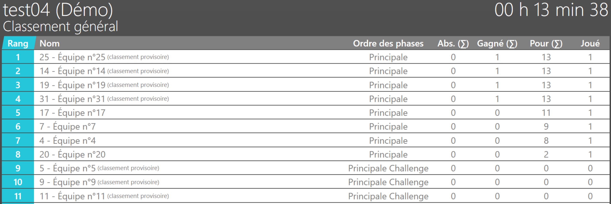

### Afficher les sponsors

1. Sélectionnez l'emplacement où se trouvent les visuels de vos sponsors en cliquant sur **Parcourir**.

    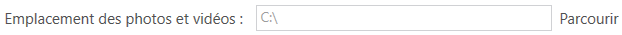

2. Cliquez sur le bouton **Afficher les sponsors** pour afficher la liste des sponsors de votre compétition.

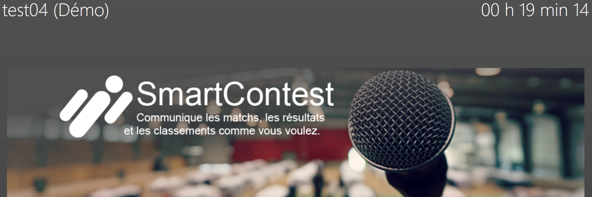