# Gérer les participants

La gestion des participants est une étape cruciale dans l'organisation d'une compétition. Elle permet de :

- suivre les pré-inscriptions, les inscriptions,
- gérer les informations personnelles des participants,
- suivre leur statut tout au long de la compétition,
- générer des rapports et des statistiques sur la participation et
- gérer les abandons ou disqualifications éventuelles.

## Gérer les pré-inscriptions

L'étape de pré-inscription permet aux participants potentiels de manifester leur intérêt pour la compétition avant la période officielle d'inscription. Cela aide les organisateurs à estimer le nombre de participants et à planifier en conséquence.

!!! note
    Cette fonctionnalité peut être utilisée avec votre billetterie HelloAsso pour une gestion simplifiée des pré-inscriptions. Pour cela, il faudra au préalable lier votre compétition à une billetterie HelloAsso (cf. [Créer une compétition](../create-competition.md)).

!!! info
    En fonction de la configuration de votre compétition, cette section peut être nommée "Joueurs inscrits", "Equipes inscrites", "Concurrents inscrits", etc.

1. Accédez à la section **Equipes inscrites** dans le menu de gestion de votre compétition.

   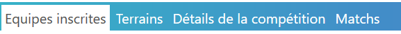

2. Pour gérer les pré-inscriptions, cliquez sur **Gérer les pré-inscriptions**.

   

3. Vous pouvez voir la liste des pré-inscriptions avec les informations suivantes :

    - Nom de l'équipe,
    - Catégorie,
    - Nom des membres,
    - Origine.

    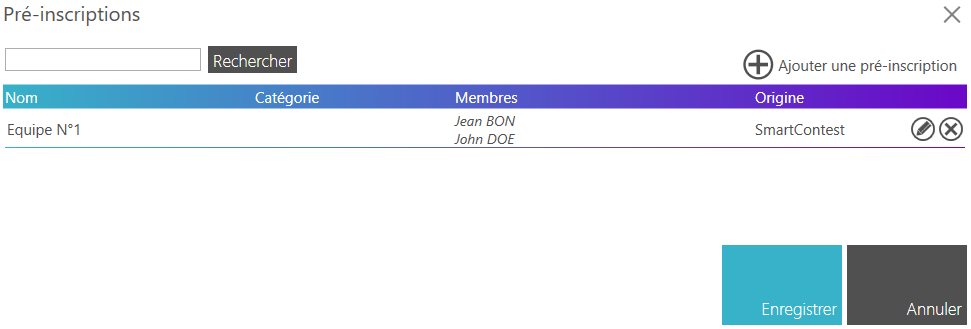

### Ajouter manuellement une pré-inscription

1. Cliquez sur le bouton **Ajouter une pré-inscription**.

   

2. Remplissez les informations requises dans le formulaire qui s'affiche.

    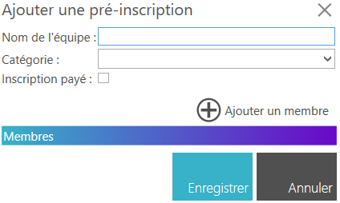

3. Pour ajouter des membres à l'équipe, cliquez sur **Ajouter un membre** et remplissez les informations nécessaires.

   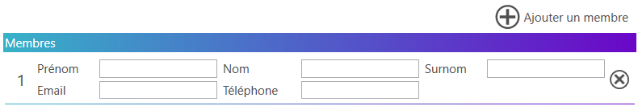

4. Cliquez sur **Enregistrer** pour ajouter la pré-inscription.

### Modifier ou supprimer une pré-inscription

1. Dans la liste des pré-inscriptions, localisez celle que vous souhaitez modifier ou supprimer.

   

2. Pour modifier une pré-inscription, cliquez sur . Apportez les modifications nécessaires dans le formulaire et cliquez sur **Enregistrer**.

3. Pour supprimer une pré-inscription, cliquez sur .

### Moteur de recherche

1. Utilisez le champ de recherche en haut à droite pour trouver rapidement une pré-inscription spécifique en saisissant le nom de l'équipe ou d'un membre.

   

### Importer des pré-inscriptions depuis HelloAsso

!!! note 
    Cette fonctionnalité est disponible uniquement si vous avez lié votre compétition à une billetterie HelloAsso (cf. [Créer une compétition](../create-competition.md)).

1. Cliquez sur le bouton **Importer depuis HelloAsso**.

   

2. Mappez les champs de votre billetterie HelloAsso avec les champs de pré-inscription de la plateforme.

    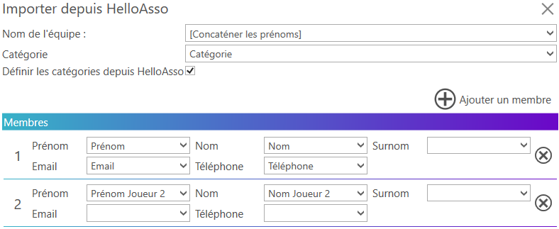

3. Cliquez sur **Charger les pré-inscrits** pour ajouter les pré-inscriptions depuis HelloAsso.

    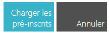

    !!! note 
        Vous avez la possibilité de déterminer le nom de l'équipe en fonction des informations de mapping des membres. 3 options sont proposées :

        - **[Concaténer les prénoms]** : Le prénom de chaque membre est concaténé pour former le nom de l'équipe (exemple : "Alice - Bob - Charlie").
        - **[Concaténer les noms]** : Le nom de famille de chaque membre est concaténé pour former le nom de l'équipe (exemple : "Dupont - Martin - Durand").
        - **[Concaténer les surnoms]** : Le surnom de chaque membre est concaténé pour former le nom de l'équipe (exemple : "Dédé - Bob - Ptit Jean").

4. Une fois l'importation terminée, les pré-inscriptions apparaissent dans la liste des pré-inscriptions avec comme origine "HelloAsso".

   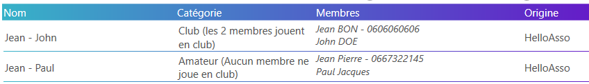

### Inscrire les pré-inscriptions

Le jour de l'ouverture des inscriptions (lors du pointage), vous pouvez convertir les pré-inscriptions en inscriptions réelles.

!!! note
   Cette fonctionnalité est disponible uniquement si vous avez démarré la phase d'enregistrement des équipes.

1. Dans la liste des pré-inscriptions, localisez celle que vous souhaitez inscrire.

   

   !!! tip
        Aidez-vous du moteur de recherche pour trouver rapidement une pré-inscription spécifique.

2. Cliquez sur  pour inscrire la pré-inscription.

    Vous pouvez aussi inscrire automatiquement toutes les pré-inscriptions en cliquant sur le bouton **Accepter toutes les pré-inscriptions**.

    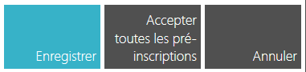

    !!! info  Cas spécifique des compétitions avec billetterie HelloAsso 
        Si une équipe lors du pointage s'est inscrite via la billetterie HelloAsso, vous pouvez scanner le QR code de son billet pour l'inscrire automatiquement.

3. La pré-inscription est maintenant convertie en inscription et apparaît dans la liste des équipes inscrites.

   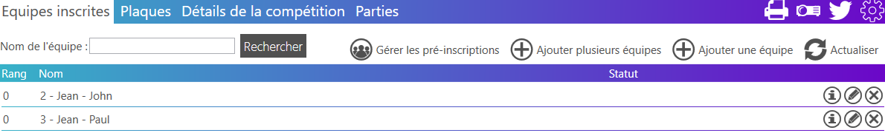

## Gérer les inscriptions

La gestion des inscriptions permet de suivre les équipes ou participants officiellement inscrits à la compétition.

1. Accédez à la section **Equipes inscrites** dans le menu de gestion de votre compétition.

   

### Ajouter manuellement une inscription

1. Cliquez sur le bouton **Ajouter une équipe**.

   

2. Remplissez le formulaire avec les informations de l'équipe (nom, membres, etc.).

   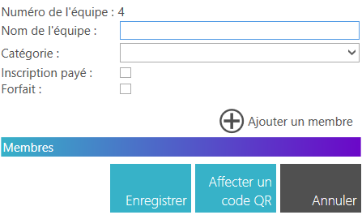

3. Si vous utiliser le système de QR code proposé par SmartContest, vous pouvez affecter un QR code unique à cette équipe en cliquant sur le bouton **Affecter un code QR**.

   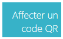

   Une fois le QR code affecté, l'équipe pourra utiliser ce QR code pour s'identifier et suivre son statut durant la compétition (matchs, scores classement, ...).

   !!! note 
        Vous pouvez imprimer les QR code de vos équipes dans la section "Impression" de l'application SmartContest (cf. : [Impression des QR codes](../img/work-with-competition/print.md)).

4. Cliquez sur **Enregistrer** pour enregistrer l'inscription.

### Modifier ou supprimer une inscription

1. Dans la liste des équipes inscrites, localisez celle que vous souhaitez modifier ou supprimer.

   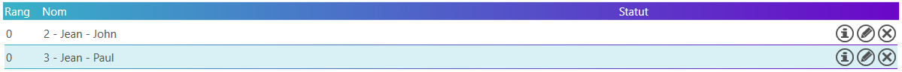

2. Pour modifier une inscription, cliquez sur . Apportez les modifications nécessaires dans le formulaire et cliquez sur **Enregistrer**.

3. Pour supprimer une inscription, cliquez sur .

### Moteur de recherche

Utilisez le moteur de recherche pour filtrer rapidement les inscriptions en fonction du nom de l'équipe ou de son numéro.

1. Saisissez le nom de l'équipe ou son numéro dans le champ de recherche en haut à droite.

   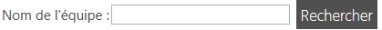

2. La liste des équipes inscrites est automatiquement filtrée en fonction de votre saisie.

### Gérer les abandons ou disqualifications

Dans le cas où une équipe ou un participant abandonne la compétition ou est disqualifié, vous pouvez mettre à jour son statut dans la liste des inscriptions.

1. Dans la liste des équipes inscrites, localisez celle que vous souhaitez marquer comme abandonnée ou disqualifiée.

   

2. Cliquez sur  pour modifier l'inscription.

3. Dans le formulaire de modification, cochez la case **Forfait** et cliquez sur **Enregistrer**.

    

L'équipe est maintenant marquée comme **forfait** dans la liste des inscriptions. Celle-ci ne sera plus prise en compte dans les matchs et sera automatiquement reléguée dans le bas du classement.

### Consulter les information d'une inscription

1. Dans la liste des équipes inscrites, localisez celle dont vous souhaitez consulter les informations.

   

2. Cliquez sur  pour consulter les informations de l'équipe.

3. Une fenêtre contextuelle s'ouvre et affiche les informations de l'équipe.

   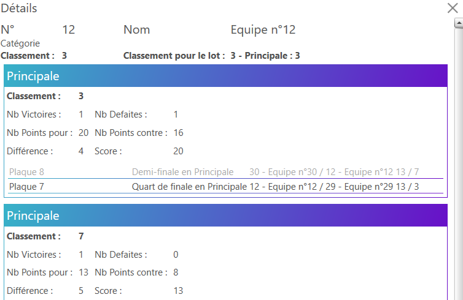