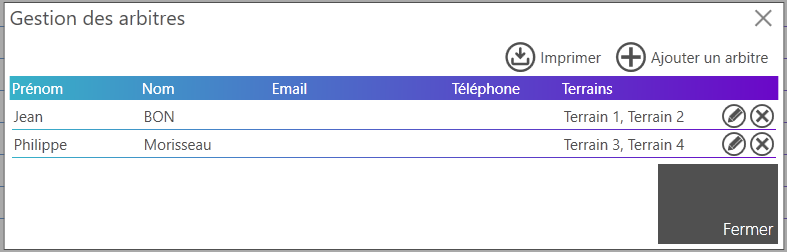
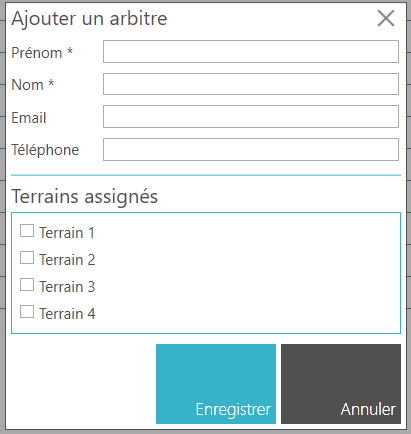
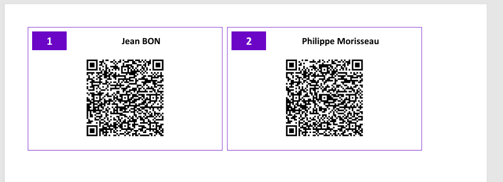

# Gérer les arbitres

La gestion des arbitres permet d'affecter un ou plusieurs arbitres aux différents matchs. Une fois affectés, les arbitres peuvent depuis l'application mobile SmartContest :

- suivre les matchs et enregistrer les scores directement.
- consulter les matchs qu'ils ont déjà arbitrés et les scores enregistrés.
- consulter les prochains matchs à arbitrer.

Pour gérer les arbitres, depuis l'application SmartContest, cliquez sur "Gérer les arbitres" dans l'onglet "Equipes Inscrites" de votre compétition.

!!! note
    Selon la configuration des rencontres de la compétition, il est possible d'affecter aucun, un ou plusieurs arbitres à un match. Veillez bien à configurer les rencontres de votre compétition en conséquence. Pour plus de détails sur cette étape, consultez la section [Concevoir une compétition](design-competition.md).

## Ajouter un arbitre

1. Cliquez sur le bouton **Ajouter un arbitre**.

      

2. Remplissez les informations requises dans le formulaire qui s'affiche.

      

3. Cliquez sur **Enregistrer** pour ajouter la pré-inscription.

!!! note
      Vous pouvez assigner un ou plusieurs terrains à un arbitre afin que lors de l'affectation des matchs, il ne soit proposé que pour les matchs sur ces terrains. Si aucun terrain n'est assigné, l'arbitre pourra arbitrer tous les matchs de la compétition.

## Modifier ou supprimer un arbitre

1. Dans la liste des arbitres, localisez celui que vous souhaitez modifier ou supprimer.

      

2. Pour modifier un arbitre, cliquez sur . Apportez les modifications nécessaires dans le formulaire et cliquez sur **Enregistrer**.

3. Pour supprimer un arbitre, cliquez sur .

## Imprimer les QR codes des arbitres

1. Dans la liste des arbitres, cliquez sur le bouton **Imprimer**.

      

2. Un document PDF contenant les QR codes de tous les arbitres est généré. Vous pouvez l'imprimer pour distribuer les QR codes aux arbitres.

      
